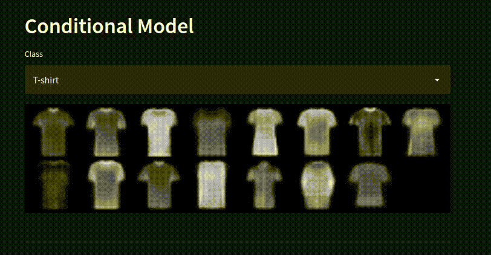

# Conditional Models

An issue we run into when developing an end to end learned driver is the ability to make decisions. Classical approaches to driving allow the car to make different decisions by using waypoints, maps or other user selected inputs. End to end usually only have a set of inputs to a model (images, kinematics, etc) and directly output actuation or control commands. 

An example of how these simplified inputs can become a problem is to imagine we come to a fork in the road. Sometimes we want to go left, sometimes we want to go right. If we train our model with imitation learning, it will learn the average driving policy. However, the average of left and right is straight ahead… which is not what we want.

There are a few problems we are running into:
- The first is we are trying to represent two different situations (turning left, and turning right), without telling the model that these are actually two different distributions. 

- At run time, we have no way of selecting to go right or left. Even if we teach our model to follow two different distributions, we need to be able to select an option at a branching point. 

One solution to this problem is to use a conditional model. A conditional model takes an additional input to the model, which can be used as a signal to the model to produce a different output based on what was passed as input. This input can be selected by the user, allowing us to change the behaviour of the model dynamically. 

Another solution might be to use a mixture model to represent the multiple distributions at work: 
- [Introduction to Mixture Models](https://stephens999.github.io/fiveMinuteStats/intro_to_mixture_models.html) 
- [Gaussian Mixture Models](https://youtu.be/Rkl30Fr2S38)

In this post, we are going to focus on conditional models because they allow us to select the behaviour of our model at run time, which is useful for navigating. 

## Conditional Models
To understand what a conditional model is, and how we can use them to make driving decisions, we are going to look at another type of conditional model, the conditional variational autoencoder. That is a mouthful, so let's step through it. 

### AutoEncoder
An autoencoder is a type of neural network architecture in which the input is the same size as the output, with a smaller bottleneck in the middle. The goal of this kind of network is to usually reconstruct the original image. This kind of network might seem a bit useless, but they have a number of practical uses:

- We can use it to learn good compressed representations (at the bottleneck) of images. Since the bottleneck is smaller than the input, it is effectively a compressed representation of the information in the image. 
- We can partially crop, or introduce noise into the input image and train the network to reconstruct the original denoised image.
- We can train the network to reconstruct a labelled, masked version of the original image, as in semantic segmentation. 

The most relevant idea is that we can force the model to encode / compress the information in the image in order to fit through the bottleneck, and be successfully reconstructed. Generally, for an autoencoder we don’t care how this information is encoded, just that it is a smaller dimension than the input.  

||
|:---:|
| AutoEncoder Architecture |

To successfully reconstruct the image, we train with a [binary cross entropy loss](https://towardsdatascience.com/understanding-binary-cross-entropy-log-loss-a-visual-explanation-a3ac6025181a) on the input and output image. This loss encourages the output image to be as close to the input image pixel wise. This loss term is usually called the reconstruction loss. 

## Variational Autoencoder (VAE)

A Variational Autoencoder (VAE) uses the same architecture as an autoencoder, except now we will force the bottleneck (latent space) to match a specific distribution (normal distribution).

Why would we want to do this? In an autoencoder, we could successfully reconstruct images by passing in an input image, but we could not use the latent space, or generate new images. This is because the latent space wasn’t organized in any meaningful way, and if we tried to reconstruct from the bottleneck it would likely be a useless image. 

If we constrain the latent space to be a known distribution, we can then sample from that distribution, and then pass our sample into the decoder to generate new images similar to our dataset. By sampling different parts of the distribution, we can generate a range of different images. In the gif below, we are showing a VAE trained on the FashionMNIST dataset generating new items of clothing similar to the dataset by sampling randomly from a normal distribution.

||
|:---:|
|Generating Images with a VAE|

We first need to restrict the latent space to be normally distributed. The KL Divergence is a measure of the difference between two probability distributions. We can use it as a loss function to encourage our bottleneck to be normally distributed. However, we have another problem, as the KL Divergence works on probability distributions our latent space must be a distribution (have a mean and variance). Unfortunately, we can’t backpropagate through a random distribution. Thankfully, people have come up with a clever [reparameterisation trick](
https://stats.stackexchange.com/questions/199605/how-does-the-reparameterization-trick-for-vaes-work-and-why-is-it-important) to allow us to do this. 

||
|:---:|
| VAE Architecture|

This loss is usually called the KL Divergence Loss, and is used in addition to the Reconstruction Loss from earlier. Therefore, our model will learn to reconstruct images while keeping the latent space as close to normal as possible. 

- Loss = Reconstruction Loss + KL Divergence Loss

||
|:---:|
| Samping from a VAE |

*Note: If you didn't understand anything about the KL Divergence, backpropagating through distributions or the reparameterization trick, don’t worry. The math is pretty heavy and not really important for what we are doing, and you can use it successfully without understanding.*

- [Variational Autoencoders](https://www.youtube.com/watch?v=9zKuYvjFFS8)
- [How does the reparameterization trick work](https://stats.stackexchange.com/questions/199605/how-does-the-reparameterization-trick-for-vaes-work-and-why-is-it-important)
- [How to understand KL Divergence Loss](https://stats.stackexchange.com/questions/394296/how-should-i-intuitively-understand-the-kl-divergence-loss-in-variational-autoen)

## Conditional Variational AutoEncoder (CVAE)

Using a VAE we saw we could generate new images that look like our dataset, but we had no control over what kinds of images these were. It would be nice if we could get the model to generate images of a certain class (e.g. generate a 5 for MNIST). 

||
|:---:|
|CVAE Architecture|

How can we do this? During training we feed in an image, but also feed in the class label at the input and the bottleneck. Now the model learns to encode the image information based on the class label, in other words the latent space is conditioned on the class label. The model also learns to reconstruct images based on this class label.

||
|:---:|
| Sampling from a CVAE |

Since our latent space is still normally distributed, we can still sample from it. But now we also provide the label of the image we want to reconstruct. We are now able to generate images of any class that we want. 

||
|:---:|
| Generating Images with CVAE |

The interesting thing is these aren’t images that were in the dataset, but new images generated by the model, based on the  sample distribution and class label. The most important takeaway is that we can change a single input to our model, and change its output behaviour. One way to think about it is that we have trained multiple different models, that we can choose to activate based on the label we use as input. 

## Relevance to Self Driving
To bring this back to self driving, if we want our end to end models to be able to make different decisions, we will need to train them in a conditional manner. 

The most common branching point in the model's behaviour is turning left or right, or changing lanes. We want our model to perform differently if we want to turn left, go straight or turn right. Therefore it is natural to choose these as our model branches.

In the CVAE example we used the class label as a condition, but we don't have any labels for driving? What can we use for these conditions? The most natural piece of information is the turning indicator on the car. We can use this as indicating the driver's desire, do they want to turn left or right? The indicator signal can be easily obtained through a vehicle’s CAN. Using these signals we can direct our vehicle to make a left, or right turn (or go straight) whilst using an end to end driving policy.

## Examples

Some real world examples of conditional models for self driving include:

### End to End Driving via Conditional Imitation Learning
In this paper, which introduced conditional imitation learning for self driving the authors train an imitation model that responds to high level commands (turn left, stay straight, turn right). They trained two models, one using the CARLA simulator, and the other on a small scale RC car driven around the university campus. In both cases they were able to successfully complete the track, and take different routes using the high level commands.  

The authors also explored two different kinds of conditional model architectures. The ‘command’ architecture concatenated the commands along with the input image and measurements (kinematics) and produced a single output. The ‘branched’ architecture concatenated the commands at much later layers, and had multiple heads. Then the output of the commanded head was used for the driving policy. They also used noise injection and augmentation to improve the training. The branched model performed much better than the command architecture. 

|
|:---:|
| Conditional Model Architectures [[REF]](https://arxiv.org/abs/1710.02410)|

- [End to End Driving via Conditional Imitation Learning](https://arxiv.org/abs/1710.02410) 
- [CARLA Conditional Imitation Learning](https://github.com/carla-simulator/imitation-learning)

### OpenPilot Desire (Comma AI)
OpenPilot uses a conditional input called desire. This input is used to tell the model the driver would like to make a lane change. To activate this, the driver uses the indicator, and the model will perform the lane change, but it won’t check if it is safe to do so. This desire vector is concatenated with the convolutional outputs. Please see the post below for model details about the openpilot model. 

||
|:---:|
| OpenPilot Desire Code [[REF]](https://github.com/commaai/openpilot/blob/master/selfdrive/modeld/models/driving.cc#L89)|

- [Decoding Comma AI OpenPilot Driving Model](https://medium.com/@chengyao.shen/decoding-comma-ai-openpilot-the-driving-model-a1ad3b4a3612) 
- [OpenPilot with Desire](https://www.youtube.com/watch?v=4GzBQSEtK2w) 

### Urban Driving with Conditional Imitation Learning (Wayve) 
In this paper, Wayve trained a conditional imitation model to drive around the streets of Cambridge, UK. They trained on only 30 hours of driving data which includes front camera images, a route plan and actuation commands from a human driver. They use a similar latent space bottleneck as the VAE style models discussed above, but instead they force this latent space to be decoded into tasks known to be useful for driving (motion, depth and semantics). 

These latent space constraints are probably helping the model train more efficiently by guiding it to encode the information in ways in which we already know are useful, rather than searching out the whole possible space. In addition, they also serve as an interpretable output for humans to help understand what the car is “thinking”. 

- [Urban Driving with Conditional Imitation Leanring](https://arxiv.org/abs/1912.00177)
- [Learned Urban Driving - Wayve Blog Post](https://wayve.ai/blog/learned-urban-driving/)

## Conclusion

In this post we have explored how we can use conditional models to change the behaviour of an end to end driving model. Conditional models provide a level of human control to enable practical road driving, which has been demonstrated in a number of papers and real world applications. 