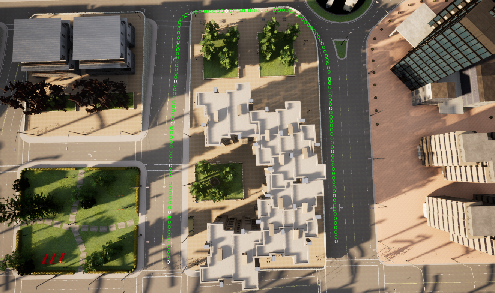

# Control

Imagine we are designing a cruise control system to make the car travel at a set velocity. We can adjust the speed of the vehicle by pressing the throttle, more throttle equals more speed. We can calculate the amount of throttle for a given speed. However, the amount of throttle we need will depend on a number of factors, such as if we are going up a hill, or down? If we just set the throttle at a certain point, we get the following behaviour.

|[](https://youtu.be/U1Xj-k020t8)|
|:--:|
|*Constant Throttle Controller*|

As we can see, the constant throttle initially gets the vehicle up to speed, but once we hit the hill we begin to slow down and eventually come to a stop and roll back down. This kind of control strategy where we pre-calculate what we are going to do is known as open-loop control. It can work well for systems where there are no uncertainties or unknowns about the environment. In control these unknowns are usually called disturbances. 

In order to maintain our speed in this example, we need to adjust the amount of throttle based on our current velocity. This type of control is known as closed-loop, or feedback control. 

## Feedback Control

In the simplest case, we can just adjust the amount of throttle we use depending on whether we are above or below the target velocity. This should slowly adjust our throttle to any disturbances. We could write an if else block to achieve this:

```python
       if self.velocity < self.target_velocity:
           self.throttle_value += 0.01
       else:
           self.throttle_value -= 0.01
```

If we actually implement this controller, we will just oscillate above and below our target speed never actually reaching this. We could adjust the parameters (such as how much we increment / decrement) to improve, but their is a better way.

|[](https://youtu.be/AR3FMTyoT8o)|
|:--:|
|*If Else Controller*|

The purpose of control theory is to design controllers that can quickly and accurately respond to disturbances or changes in our set point. Many families of control algorithms and model types exist for use in different applications and systems. The most common and widely used controller is the Proportional, Integral, Derivative (PID) Controller. 

||
|:--:|
|*Feedback Control Diagram - Wikipedia*|

## PID Control

In control, the term error describes the difference between target value and the current value (velocity in our case). The PID Controller combines three different measurements of error; the current error, the change in error, and the accumulated error. We then multiple each one of these errors by a factor, and combine them together to get our final control output. These factors are called gains, and each one of these can be tuned to change the behaviour of our controller.

The following video is a good [Introduction to PID Control.](https://youtu.be/4Y7zG48uHRo)

```python
       # calculate error
       err = self.target_velocity - self.velocity
 
       # proportional
       p_component= self.P_GAIN * err
 
       # derivative
       d_component = self.D_GAIN * (err - self.prev_error)
      
       # integral
       i_component = self.I_GAIN * self.accumulated_error
 
       # set throttle value
       self.throttle_value = p_component + d_component + i_component
       self.throttle_value =  np.clip(self.throttle_value, 0, 1.0)
 
       # calculate error terms
       self.prev_error = err
       self.accumulated_error += err
```

We don’t have to use all components in the PID, and can pick and choose. For example, we might decide to only use PD if that performs well enough and the I component is difficult to tune. 

In the next video we can see the effect of changing each of the gains and adding different components to the controller. (NB: orange line is the target velocity).

|[](https://youtu.be/hxwA6dqaJSw)|
|:--:|
|*PID Control Demo*|

A difficult part of tuning these types of controllers is the sensitivity to changes. For example, if we increase the target velocity to 20km/h (5.6 m/s) from 12km/h (3.5 m/s), our same PID controller from above no longer works. Tuning controllers to work over a wide variety of parameters is another topic in itself. 

|[](https://youtu.be/Zp1EkbCNL90)|
|:--:|
|*PID Controller- High Velocity*|

PID is the hello world of control, but works pretty well most of the time and is the most widely used controller. If you want to learn more about other families of controllers, and control theory in general then see Brian Douglas’ YouTube channel. He explains the theory in an intuitive way, and got me and many other people through university control theory classes.

**Brian Douglas**
- [Control Systems Playlist](https://www.youtube.com/watch?v=ApMz1-MK9IQ&list=PLn8PRpmsu08pFBqgd_6Bi7msgkWFKL33b) 
- [PID Playlist](https://youtube.com/playlist?list=PLn8PRpmsu08pQBgjxYFXSsODEF3Jqmm-y)


## Feedforward Control
We saw that if we just set our control strategy in advance (fixed throttle), we can't respond to changes in the environment. We implemented feedback control to correct for these unpredictable errors. However, some effects can be known in advance, and we try to model them into our system. 

For example, we know that as we drive, air resistance and friction will gradually slow us down if we don’t constantly provide enough power to overcome it. If we can model this effect well, we can provide enough throttle to overcome it, and leave our feedback controller to only handle the unpredictable changes. This type of control is called feedforward control.

Feedback controllers (such as a PID) are reactive, whereas feedforward control tries to model the system and be proactive about changing the system. We can combine both these types into a single controller. 

**Feedforward Control Examples**
- [What is Feedforward Control?](https://youtu.be/FW_ay7K4jPE)
- [What are PID and Feedforward Gains?](https://www.motioncontroltips.com/faq-what-are-pid-gains-and-feed-forward-gains/) 
- [OpenPilot PIController (+feedforward Gain)](https://github.com/commaai/openpilot/blob/4f7840a83c2c7ec8ea3110855a8c33448faa6047/selfdrive/controls/lib/pid.py#L13)

In order to be proactive about control, we need to accurately model the behaviour of the vehicle, to understand how it will respond to changes in our control inputs, as well as the external environment (e.g. hill gradient, road surface, wind, etc).
 
## Vehicle Dynamics Model

The Bicycle Model is a simple, but widely used model for describing the motion of the vehicle. This model simplifies the four wheels down to two, ‘mounted’ at the centre of each axle (like a bicycle). It provides a fairly accurate model of the motion with a much lower computational cost than a full dynamics model. 

||
|:--:|
|*Bicycle Model - TheF1Clan*|

**The Bicycle Model**
- [The Kinematic Bicycle Model](https://thef1clan.com/2020/09/21/vehicle-dynamics-the-kinematic-bicycle-model/)
- [Vehicle Dynamics: Kinematic Bicycle Model](https://www.youtube.com/watch?v=HqNdBiej23I) 

We can use these types of models to predict the trajectory of our vehicle given the current control inputs (steering, velocity, etc).

|[](https://youtu.be/URKknR7UJJM)|
|:--:|
|*Kinematic Bicycle Model Prediction*|


Utilising a vehicle model allows us to plan our control actions over a time horizon rather than just using the current vehicle error as in a PID. An example is Model Predictive Control (MPC). 

In MPC, the model is used to predict the vehicle's motion over a short time horizon, and then an optimiser chooses the best controller inputs to satisfy a cost function over this horizon. The cost function can take into account many factors such as set point errors, constraints on maximum accelerations, or passenger comfort (minimise fast accelerations). Each factor can be weighted to guide the optimiser to the desired solutions. For example, minimising set point errors might be weighted ten times higher than passenger comfort. 

The following two videos show a PID and MPC controller used on the same track, with the same set of waypoints. The PID is constantly oscillating around the set point, and had to be run at a lower speed due to the difficulty tuning it. On the other hand, the MPC is able to be run at a higher velocity, and is much smoother at the same time. 

|[](https://youtu.be/4wfcjDTAlfc)|
|:--:|
|*Udacity PID Project*|

|[](https://youtu.be/sj02EZDvx2g)|
|:--:|
|*Udacity MPC Project*|

The code for both projects is available here: 
- [Udacity PID Project](https://github.com/patrickcleeve/CarND-Term2-PID-Control-Project-P4/blob/master/src/PID.cpp)
- [Udacity MPC Project](https://github.com/patrickcleeve/CarND-Term2-MPC-Project-P5/blob/master/src/MPC.cpp)

Planning our control over a time horizon results in a smoother, more consistent trajectory. 

Note: Although, technically our bicycle model is a [kinematic model](https://physics.stackexchange.com/questions/1135/what-is-the-difference-between-kinematics-and-dynamics), we will refer to it as a dynamics model as it will be compared to other dynamics models. Dynamics models are much more complex than kinematics as they consider the forces acting on the vehicle. This type of kinematics model is perfectly fine for our purposes here as we only care about the kinematics (position, velocity, acceleration). We will discuss more complex dynamics models next.

**Dynamic Models Examples**
- [The Dynamic Bicycle Model](https://thef1clan.com/2020/12/23/vehicle-dynamics-the-dynamic-bicycle-model/) 
- [Modelling a Vehicle Dynamics System](https://au.mathworks.com/help/ident/ug/modeling-a-vehicle-dynamics-system.html)

## Simple vs Complex Models

As discussed above, there are more complex dynamics models we could use to model our vehicles motion. The use of these models depends on both the application and the objectives:
- Some tasks require very accurate control, e.g. robot gripper or walker
- Some tasks have lower requirements, e.g. accuracy, response time
- Some sophisticated control algorithms require very accurate models to be worthwhile
- Some tasks require the models and controls to be run real time

For example, above we used the simplified bicycle model for our vehicle, that does a pretty good job for our objective (move the car along the defined waypoint path). We don't need millimetre accuracy, nor are we trying to go as fast as we can, so we can use this simplified model and controller and try to spend our computation savings somewhere else (e.g. better perception or planning to get better waypoints?). 

||
|:--:|
|*CARLA Waypoints*|

As long as we understand the tradeoffs and limitations of using simplified vehicle dynamics models, they can be used without a performance impact. The conclusion from this paper is to limit the lateral acceleration when using a bicycle model, as the modelling errors become larger when under high lateral acceleration.
- [The kinematic bicycle model. A consistent model for planning feasible trajectories for autonomous vehicles](https://www.researchgate.net/publication/318810853_The_kinematic_bicycle_model_A_consistent_model_for_planning_feasible_trajectories_for_autonomous_vehicles)

||
|:--:|
|*High Lateral Acceleration Event*|

Knowing this, if we were designing a racecar (with high lateral acceleration when cornering), we would need to use a more sophisticated model of the vehicle, so we can push the limits of how fast we can go. Improvements to our model might include using the actual dynamics of the vehicle (forces, not velocities), or better modelling of the steering geometry, or the tyres. 

**Vehicle Models**
- [Ackermann Steering 1](https://www.youtube.com/watch?v=oYMMdjbmQXc) 
- [Ackermann Steering 2](https://www.youtube.com/watch?v=yYAw79386WI)
- [Tyre Slip Angle](https://youtu.be/1NTdXhLnA_w) 
- [Pacejka Magic Tyre Formula](https://au.mathworks.com/help/physmod/sdl/ref/tireroadinteractionmagicformula.html)

All of these factors would likely produce a more accurate model of how the vehicle actually behaves but with higher computation requirements.  These better dynamics models, can be paired with advanced controllers (e.g. LQR: [[1]](https://youtu.be/E_RDCFOlJx4), [[2]](http://www.kostasalexis.com/lqr-control.html)) for improved performance. Although these controllers provide better performance, they have their own constraints (e.g. quadratic cost function), and limitations (what happens if you can’t accurately model your system?). 

At the end of the day it is important to remember the famous quote, [“All models are wrong, but some are useful”.](https://en.wikipedia.org/wiki/All_models_are_wrong)

## Reinforcement Learning for Control

When the modelling is complex enough (grasping, walking), it can be very difficult to use classical controllers over a range of scenarios (e.g. picking up different objects). Recently reinforcement learning has had a lot of success in these more complicated domains. 

In reinforcement learning, the model (the robot / manipulator) is rewarded for good actions (picking up an item), and punished for failing. Through this kind of trial and error experience the robot is able to learn which actions are effective for the task, and which aren’t. It enables the robot to learn grasping / walking strategies that would be almost impossible to program in a classic way. 

However, reinforcement methods are very brittle and sensitive to the reward function used. If the reward function is not well specified, the model can quickly learn to exploit the reward without actually completing the desired task. The methods also require huge amounts of data (even for deep learning) in order to learn, which can be impractical on real robots. Although simulation (just as in control theory) is used extensively, there is always a gap between the simulator and the real world that must be overcome.  

**Reinforcement Learning Examples**
- [An Introduction to Reinforcement Learning](https://youtu.be/JgvyzIkgxF0)
- [OpenAI: Solving Rubiks Cube](https://openai.com/blog/solving-rubiks-cube/) 
- [Deepmind: Emergence of Locomotion Behaviours in Rich Environments](https://youtu.be/hx_bgoTF7bs)
- [DeepGait: Planning and Control of Quadrupedal Gaits using Deep Reinforcement Learning](https://youtu.be/jIKhnWzcdbg)


## Conclusion
Control is a very important topic in robotics, but the main focus of this post was about control for self-driving applications. From a controls perspective the task of following waypoints is fairly straightforward compared to other applications. Since the control system is downstream from other systems (perception, planning), it is highly dependent on how well they function to do its job. If you cannot detect objects, or properly plan paths the quality of the control system is irrelevant. 

Many of the topics in control theory, such as modelling or optimisation are important for other areas of self driving like planning or simulation. Learning more about control can introduce you to the approaches and tools that have been developed for these kinds of problems, and how they can be used for other applications. 

*PS: Although I got through this whole thing without one mention of a laplace transform or the s-domain, they are probably good to know about. Start here: [Introduction to Time and Frequency Domains](https://youtu.be/noycLIZbK_k)*

## Reference
- [Control Theory Wikipedia](https://en.wikipedia.org/wiki/Control_theory)
- Code: https://github.com/patrickcleeve2/planning  
