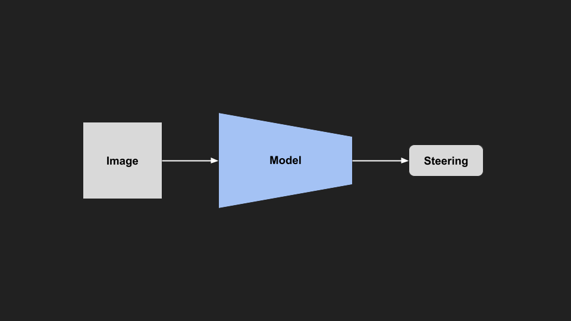
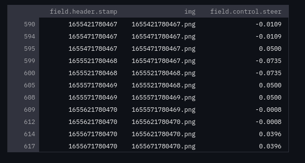
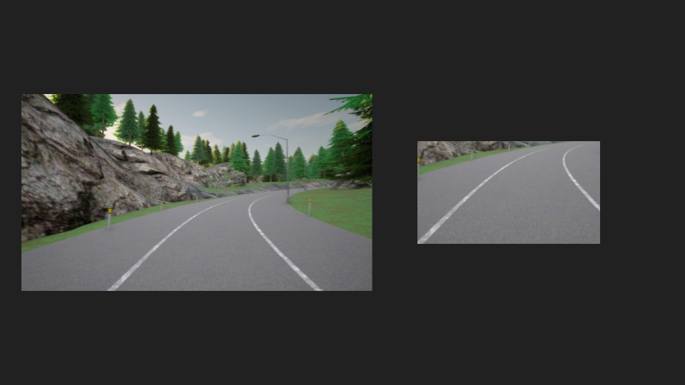
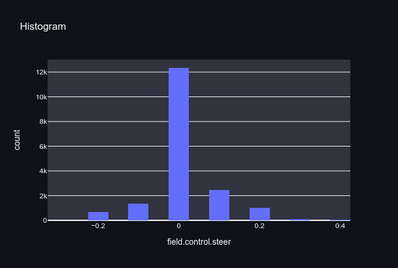
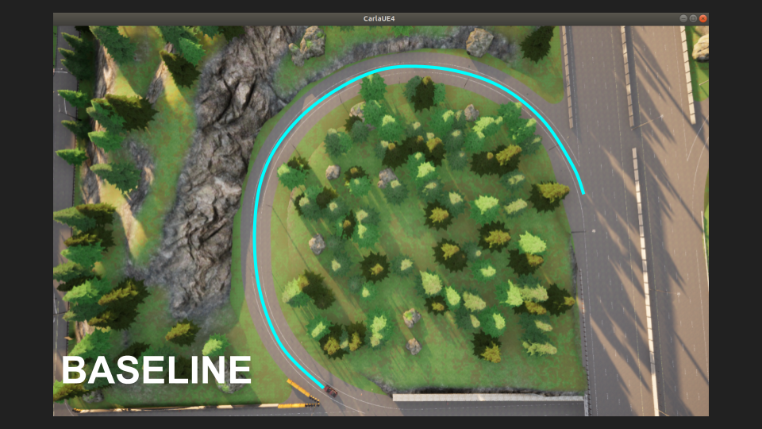
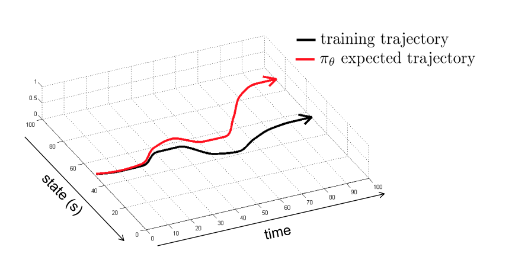
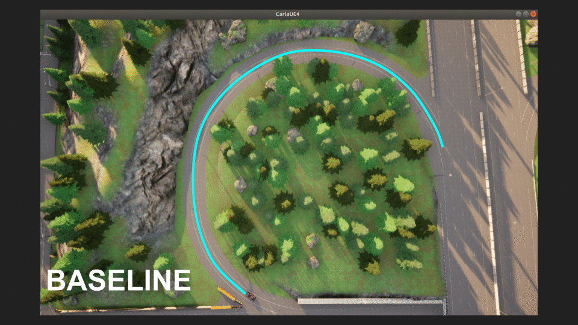
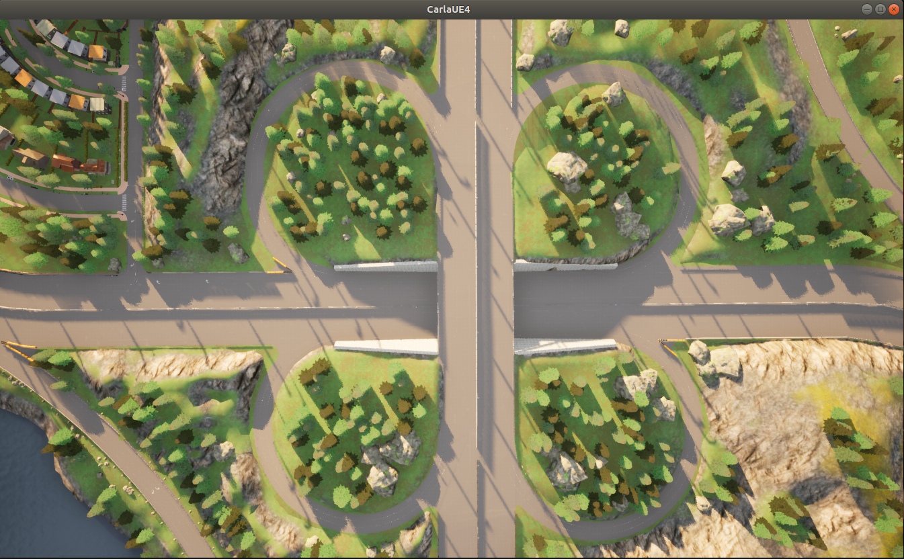

# End To End Learning

One of the projects you complete as part of the Udacity self driving program is the [Behavioral Cloning Project](https://youtu.be/nz_gdvrOV2I). In this project you record yourself driving (front camera images, and steering angle) around a test track, and then train a neural network to imitate your driving. This always stuck with me, as it was a completely different approach. No longer did you have to break down the problem into separate perception, planning and control tasks, nor hand craft any algorithms or rules for the systems, it was all just learned from data.  

The project solution had many serious limitations for any real world driving (although it was shown to work by [Nvidia](https://images.nvidia.com/content/tegra/automotive/images/2016/solutions/pdf/end-to-end-dl-using-px.pdf )), but since then I have always been curious about what it would take to make a real world system work in this manner. This approach, broadly called end to end learning, has been championed by [Comma](https://github.com/commaai/openpilot) and [Wayve](https://wayve.ai/). 

In this project, my goal is to build my own version of end to end learning that can be used in real vehicles and simulation.

The first step is to reimplement the behavioural cloning project in simulation and then in a real world vehicle. 

## Carla Simulator Behaviour Cloning

As a simple starter project, I have recorded myself driving along a short, curved part of the road in the CARLA simulator. For this project I will be using ROS to interface with CARLA, and PyTorch to train and run the model.

|[](https://youtu.be/cNxU5shAcvI)|
|:--:|
|*Imitation Path*|

The data consists of images from the front camera, and steering angle measurements. Using the carla_ros_bridge (https://github.com/carla-simulator/ros-bridge), we can get this data from the following topics, and save them into a rosbag.
- /carla/hero/camera/rgb/front/image_color
- /carla/hero/vehicle_status/control/steer

 From this data we will train a small resnet18 to imitate this driving.  

| |
|:--:|
|*Model Architecture*|

## Data
Once we have collected some baseline data in a rosbag, we need to prepare and format the data for training. We will need to synchronize our images and steering using the timestamps. An easy way to do this is to save each image using the timestamp as a filename, and the steering data (+ timestamp) as a csv. We can then join the list of images, and steering data on the timestamps using a library like [pandas](https://pandas.pydata.org/).

To quickly extract topic data from a ROSBAG as csv, we can use the following command:

``` bash
$ rostopic echo -b bagfile.bag -p topic_name > data.csv		
```


I wrote the following helper function to do both: 

``` python
def extract_data_from_rosbag(bag, config):
   """Extract all topics from a ROSBAG into images and csv files"""
 
   # topics to extract from the config file
   extraction_topics = config["extract"]["topics"]
 
   # load the bag info
   bag_info = yaml.safe_load(bag._get_yaml_info())
   print("ROSBAG Info:")
   pprint(bag_info)
   print("\n")
 
   # cv2 bridge
   bridge = cv_bridge.CvBridge()
 
   # extract each topic in the bag
   for topic in bag_info["topics"]:
 
       topic_name = topic["topic"]
       n_messages = topic["messages"]
       topic_type = topic["type"]
 
       print(f"Extracting {topic_name} ({topic_type})")
       if topic_type == "sensor_msgs/CompressedImage":
 
           for t, msg, a in tqdm(
               bag.read_messages(topics=topic_name), total=n_messages
           ):
 
               # convert from rosmsg to np.ndarray
               img = bridge.compressed_imgmsg_to_cv2(msg)
 
               img = img[:, :, ::-1]  # bgr to rgb 
 
               # save image (fname = timestamp)
               fname = str(msg.header.stamp) + ".png"
               PILImage.fromarray(img).save(base_dir + fname)
 
       else:
 
           # extract other topics to csv using cmd line tools
           topic_base_name = "".join(topic_name.split("/")[1:])
           csv_filename = base_dir + topic_base_name + ".csv"
           ret = os.system(
               f"rostopic echo -b {filename} -p {topic_name} > {csv_filename}"
           )
``` 

Once extracted and joined, our data is ready for training. 

||
|:--:|
|*Training Data*|

## Strategy
To collect the required data, we will use the same strategy as the udacity project. We will collect a baseline dataset to train a model, and then let our model drive along the road. Once it begins to go off, we can take control and record some ‘recovery’ driving to get it back on track. We add the recovery data to our dataset, and retrain our model. 

|[](https://youtu.be/jZtu76YPsxk)|
|:--:|
|*Imitation Failures*|

Using this method, we are able to get it to work in about three laps (2 min), plus a few recovery attempts. 


|[](https://youtu.be/tXphab3f5tI)|
|:--:|
|*Imitation Success*|

## Hacks Used
In order to get this quick example working, we have used the following hacks to help out the model. 

We’ve clipped the steering  output, so it can only turn the steering wheel a little bit, which helps it stay on track and not fall off the tightrope (explained later). 

``` python
# model inference
out = self.model.model_inference(img)

# set model outputs as controls
msg = CarlaEgoVehicleControl()
msg.throttle = self.MAX_THROTTLE
msg.steer = np.clip(out[0], -self.MAX_STEER, self.MAX_STEER) 
```

We’ve cropped the image to only the centre of the image. This excludes all the areas that arent of interest to driving allowing the model to focus on the region with relevant information (lane area).

| |
|:--:|
|*Image Cropping*|

``` python
def _crop_img(self, img):

    # crop image to centre view
    w = img.shape[1] // 4
    h = img.shape[0] // 2
    img = img[h:, w:3*w, :]  # (bottom half (height), middle half (width))

    return img
``` 
I manually adjusted the set speed and steering limits to get the model to work. If I change the speed and steering limits, the model fails the course. Obviously doing this at a larger scale is not sustainable.  

## Results
The model works pretty well, as after only 2 minutes of data collection we can keep the car on the road. The model is pretty small so it runs really fast, and we only needed a single camera, and a way to control the steering. Compared to a classical self-driving system, there are far fewer moving parts. 

However... It only works on this specific part of the road. 

|[](https://youtu.be/nCRQ0S9GJz4)|
|:--:|
|*Trying to Imitate on Unknown Roads*|

When testing out the model on other areas of the road, it failed pretty miserably. On the freeway, it went immediately off the road, and even on similar looking (to a human) curved roads it went off regularly. We could likely improve the performance by collecting more recovery driving on these areas, and building up our dataset, but there are some reasons why this will only get more difficult the longer the road becomes. 

As a first step, we can try to look at our training data to see why we might be struggling in these sections. 


|[](https://youtu.be/gIlHU1OPoKM)|
|:--:|
|*Training Data*|

Looking at the playback of the training data, it is pretty janky and I’m not a very good driver. In my defence it is pretty hard to drive in the simulator as the car accelerates very quickly and the steering snaps back to zero when not pressed. This results in most of the steering commands being very close to zero (even though we are turning most of the time). 



Even though we did collect driving going both ways (left turn and right turn), there is an imbalance turning right, which skews the data. Whilst it doesn’t matter too much for this example, it will bias our model towards turning right, particularly when it encounters situations it hasn't seen before (see the failure video above).

We could continue to collect more training data, and retrain our model. Theoretically, if we kept going we might eventually generalise, but we would need a much bigger model, and **A LOT** more time. However, from experience if we keep going down this path we are going to get very diminishing returns, and our model will struggle to imitate us as expected. 

## Why didn't this work as well as expected?
We have tried to turn our self-driving problem into a supervised learning problem. In comparison to training a similar sized classifier (e.g. to classify images as cats or dogs), the model and amount of data should have been more than enough. So what went wrong?

The problem we are running into is well known in imitation learning. Driving a car is a sequential decision making process, meaning our actions (how much we steer) influence the state we end up in (where the car is). This transition is often drawn as follows, and is modelled as a [Markov Decision Process](https://en.wikipedia.org/wiki/Markov_decision_process).

||
|:--:|
|*State -> Action -> State’*|

Practically, this means if our model makes even a small mistake, we will end up in a different state than we saw in training, which will likely cause us to make an even bigger mistake, repeating the cycle. In comparison to a classifier, making a mistake on one image has no impact on classifying the next image. 

||
|:--:|
|*Baseline Tightrope*|

An explanation that has always clicked with me is to imagine the data we collected for training as a tightrope. If we can exactly match this tightrope (distribution), we can stay on course. But as time goes on, our probability of making a single mistake grows, and all it takes is one mistake to fall off the tightrope.

||
|:--:|
|*Tightrope Diagram - [Berkeley DeepRL](http://rail.eecs.berkeley.edu/deeprlcourse/static/slides/lec-2.pdf)*|
 
This sequential decision making problem is going to ruin our day for a long time.

The ‘recovery’ data we collected is more formally a kind of DAgger (Dataset Aggregation) algorithm. Conceptually, we can think of this as expanding our tightrope, making it hard to fall off. The more DAgger data we collect, the more reliable our model should become. 

||
|:--:|
|*DAGGER Tightrope*|

However, collecting this data ourselves is time consuming or expensive. So we need a new strategy:
- We could use CARLA’s built in autopilot to drive around and collect data for us. This could work for a simulator model, but it is hard to transfer to the real world (sim2real problem). 
- We could over-instrument the car to multiply the amount of data - we collect in each run (see NVIDIA End to End).
- We could record other people driving and aggregate them. This is [Comma’s strategy](https://comma-ai.medium.com/towards-a-superhuman-driving-agent-1f7391e2e8ec) for collecting data from thousands of lower cost devices. 

Even with huge amounts of data, we would still have to be careful falling off the tightrope. The way we have structured the problem (supervised learning) makes our model very brittle to experiences outside of its own training data. Collecting more data to recover from every mistake would quickly become overwhelming, so we are going to have to restructure the problem so our model is able to learn from its own mistakes. 

||
|:--:|
|*Is it practical to cover the whole area?*|

To continue progressing we are going to have to tackle these two main problems:
- How do we collect the large quantities of data required to imitate?
- How do we get the model to learn from its failures?

Although these problems are significant, they aren’t insurmountable. So far, we have been able to learn the whole problem from data, with minimal hand crafting. Additionally, it is nice that this seems kind of close to how humans learn to drive (or do anything). First, we observe others and try to imitate what they are doing. Then as we gain our own experience, we adjust our behaviour when we make mistakes or succeed. Getting a computer to do the same is slightly more difficult. 


# Reference
- [Nvidia End to End](https://images.nvidia.com/content/tegra/automotive/images/2016/solutions/pdf/end-to-end-dl-using-px.pdf) 
- [Udacity Behaviour Cloning Project](https://youtu.be/nz_gdvrOV2I) 
- [Berkeley Deep RL - DAGGER](https://rll.berkeley.edu/deeprlcourse-fa15/docs/2015.10.5.dagger.pdf)
- [A Reduction of Imitation Learning and Structured Prediction
to No-Regret Online Learning (DAGGER Paper)](https://www.ri.cmu.edu/pub_files/2011/4/Ross-AISTATS11-NoRegret.pdf)  
[RL Imitation Learning - Johnathan Hui](https://jonathan-hui.medium.com/rl-imitation-learning-ac28116c02fc)  
- [Berkeley Deep RL Course](http://rail.eecs.berkeley.edu/deeprlcourse/)  

