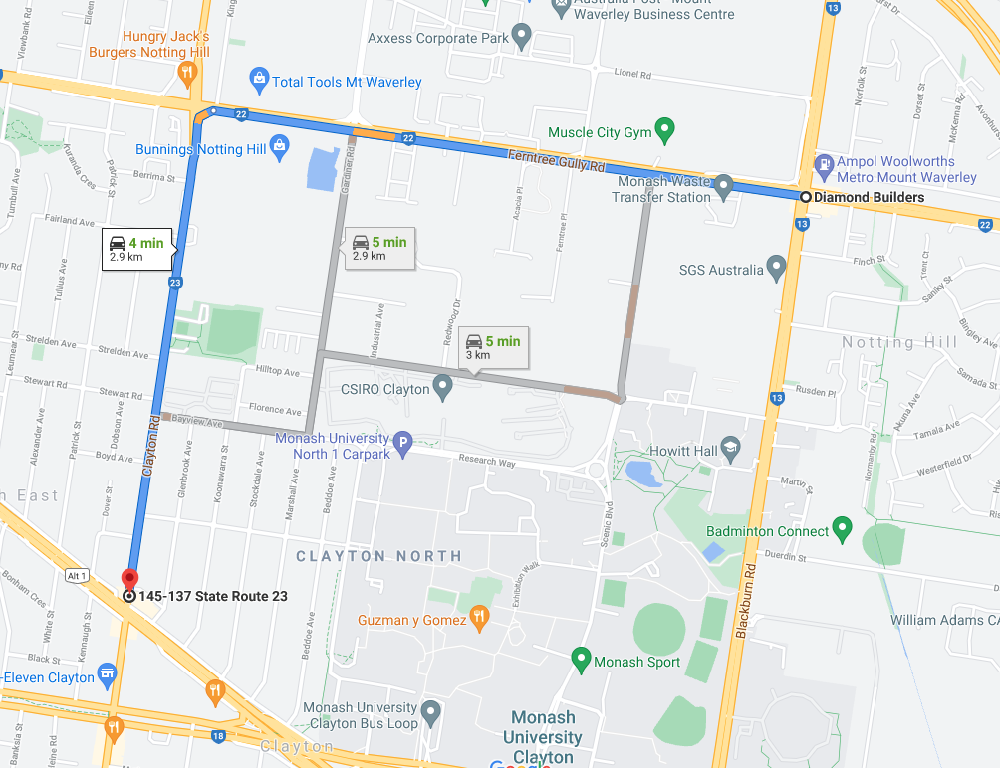
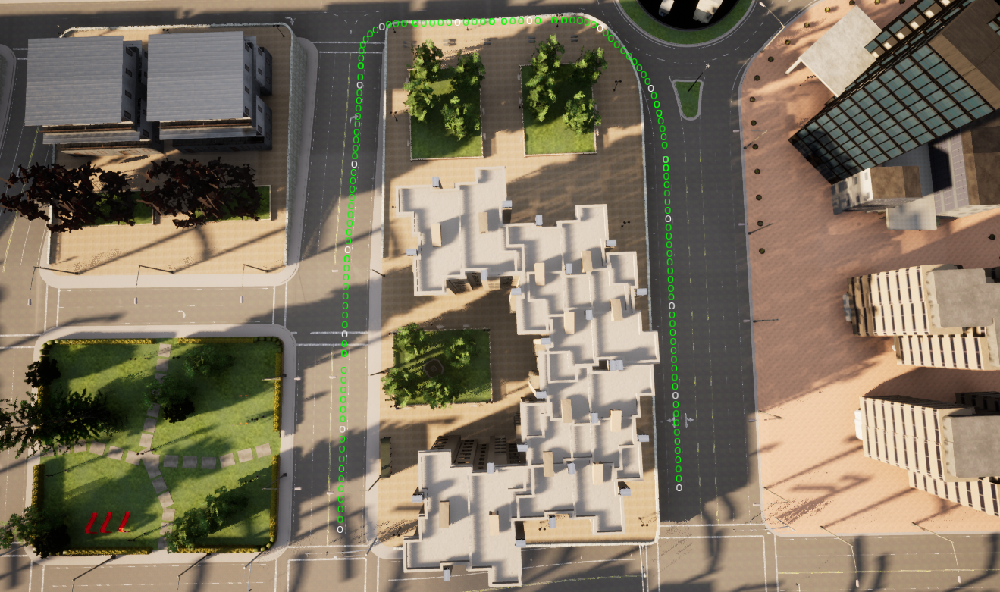
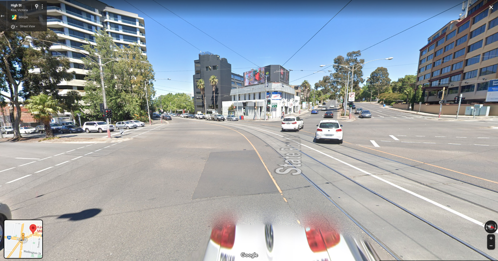
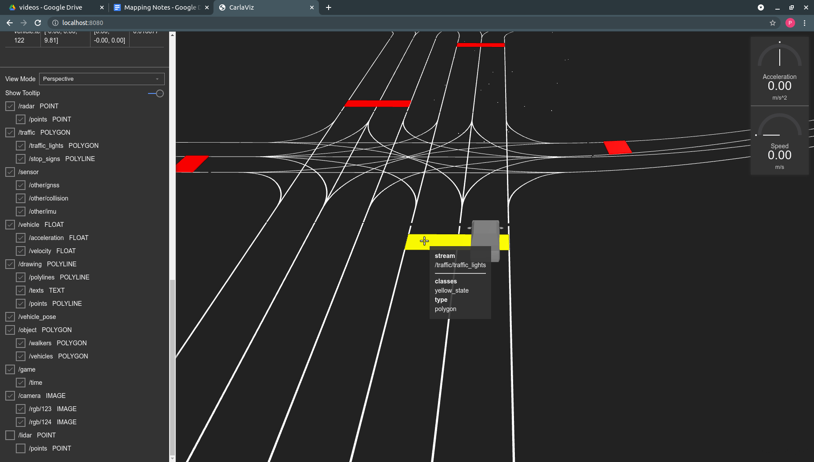

# Mapping

## What problem are we trying to solve?
When driving there are two kinds of objects we need to pay attention two; the first is dynamic objects, such as cars, pedestrians and cyclists. We need to be able to detect, and predict their behaviour so we can safely drive without hitting them. The second kind is more static ‘objects’ or road infrastructure, such as lane lines, traffic lights and other signs. These define where we can drive, what we are allowed to do and the overall environment. 

As this type of infrastructure is fairly static it can make sense to pre-map them, so we don’t have to detect them in real-time. We can also pre-plan routes since we already know the road structure in advance. In addition, once we have this map with all the static infrastructure, we can free up some compute for doing real time detection on dynamic objects, hopefully improving our performance. 

In this post, we are going to go over the different kinds of maps used for self-driving, how they are created and maintained, and discuss the advantages and limitations of these approaches. 

## What is a Map?
There are several different kinds of maps for self-driving each with a different use case. 

## Navigation Map
This is the most familiar kind of map that we are all used to. This map represents the road network, and can provide directions and navigation instructions. These are practically the same kind of map you have on your phone with Google Maps, and they work in the same way. You can input a destination, and the map will tell you the directions to take. Most cars now have a similar navigation map built into the dashboard display.

Some examples of navigation providers include [Google Maps](https://developers.google.com/maps/documentation/directions/overview ), [Mapbox](https://docs.mapbox.com/help/glossary/directions-api/), and [Apple](https://www.apple.com/au/ios/carplay/ ). To learn more about how these navigation maps are implemented, please see here:
- https://blogs.cornell.edu/info2040/2011/09/14/google-maps-its-just-one-big-graph/   

Whilst these maps are necessary, they aren't sufficient for driving. The general instructions (stay straight, turn right in 100m) don’t provide enough detail for the car to navigate. We need a much finer level of detail to drive safely. We need to know the exact positions, and speeds that we want the car to be at. 

||
|:--:|
|*Google Maps - Navigation Map*|

The navigation map can be used to provide global waypoints for the car to follow, often called the global plan. In between these global waypoints, the car has to plan a detailed path to follow, called the local plan. The local plan includes more detailed information such as the exact position, speed and state of the car at any point along this path. The local plan will be constantly updated in response to new information such as detecting pedestrians crossing the road. We will discuss these kinds of plans in another post.  

|  |
|:--:|
|*CARLA Waypoints*|

## Semantic Map
*Also called ADAS, or Vector Map*

As mentioned before, the static road infrastructure doesn’t change much, but it’s very important to know where the lane lines are, where the stop signs are and much more. Since it doesn't tend to move much (unlike pedestrians), we can just just make a map indicating where every important piece of infrastructure is. This kind of map is known as a semantic map. 

Once we have this kind of information in our map, it eliminates a lot of real time calculations we have to do.

For example:
Once we have the lane lines in our map, we can pre-calculate the path the car should drive. Therefore, when we drive we only need to follow this path, and detect if something is in our way. The alternative is to have to detect the lane lines, calculate a path to stay in the lane lines, and also check if anything is in our path, all in real time.

Another example:
At an intersection, it can be difficult even for humans to tell which traffic lights correspond to your lane. We can encode this information into our map to say that lane 1 = left traffic light. Then when we come to this intersection, since we know the position of our car, and the position of the traffic light, we can look at the region in our camera image to check whether the light is green, orange or red. Without a map, the car would have to not only detect all the traffic lights it can see, but also interpret which one corresponds to its lane. 

|  |
|:--:|
|*Multiple Traffic Lights - Google StreetView*|

The types and amount of information that you can encode into a map are enormous. Aside from the position, and motion of dynamic objects (pedestrians, cars), there isn’t really a limit. Even then, we could hand code into our map knowledge about how pedestrians behave at a certain intersection, or to watch for cars coming quickly around a corner, in order to help the real-time detections. Traditionally, all this information was input manually into the map, with a human having to go through and label each part. Although these days more tooling and automation exists, there is still a large manual component to creating these types of maps.

The objective of mapping is to pre-calculate as much about the world, and the actions the car should take to minimise the amount that needs to be done in real time. This investment in mapping tries to simplify the self-driving problem by deconstructing it into these two problems. However, building and more these detailed maps is time-consuming and expensive. 

| |
|:--:|
|*Road and Traffic Light Data from a Semantic Map - CarlaViz*|

To get a better sense of what these maps look like, and what kind of information they can store, check out this [OpenDRIVE map viewer](https://sebastian-pagel.net/). It allows you to view any OpenDRIVE map file (.xodr, a type of map file) in the browser.  You can see how each lane is classified, and contains the coordinates for each lane, and more.

## HD Map (Point Cloud Map)

Having an information rich semantic map can help us solve some problems, but presents us with a new one; How do we find out where we are in this semantic map? This problem is known as [localisation](https://en.wikipedia.org/wiki/Robot_navigation). 

*NB: We previously discussed odometry style localisation in another [post](../odometry/odometry.md), so we will focus on map based methods here.*

Map based localisation is the process of determining the position and orientation of the vehicle in a known map (frame of reference). There are a number of different methods for localisation, and these can be combined with odometry methods to provide a better estimate. The advantage of using a map for localisation is that we can compare the current sensor readings and features to those in our map, and match them together like a puzzle. 

For example, if we see a tree to our right, we know the only places in the map we can be is with a tree to our right, which we can combine with other features to narrow down where we are. 

||
|:--:|
|*Point Cloud Map Comparison*|

If you are interested in learning more about localisation, this is a good playlist to get started: 
- [Udacity Localisation Playlist](https://youtu.be/31xZhj2uPr4?list=PLAwxTw4SYaPkCSYXw6-a_aAoXVKLDwnHK)

It’s obviously pretty difficult to explain to a car that there is a tree on our right and how to look for trees in a map, so we need a different way to represent our world in the map. The most common map creation method is to use a [LiDAR](https://en.wikipedia.org/wiki/Lidar). 

A LiDAR is a laser scanner, usually positioned at the top of the vehicle with a 360 degree view around the car. The laser spins around and returns the distance to objects around the car. (NB: there are many new different types of Lidar with different modes of operation, and some vehicles also use multiple lidars, but this is the most basic setup). 

The 3D LiDARs used have multiple channels to make measurements at different heights / angles providing a detailed view around the vehicle. The LiDAR data is called a point cloud, and can be used to produce interesting visualisations such as the one below (distance is represented by colour).  

||
|:--:|
|*Driving with the LiDAR Point Cloud*|

To produce a map, we simply drive the vehicle around and record the LiDAR point clouds. Then once we have finished, we use software to stitch the individual point clouds together to produce a single point cloud map of the area. 

| |
|:--:|
|*Driving through the Point Cloud Map*|

When it comes time to localise the car, we compare our current lidar point cloud to the map, and use a [scan matching technique](https://medium.com/self-driving-cars/ndt-matching-acff8e7e01cb) to find the corresponding location in the map.   

||
|:--:|
|*Point Cloud Map and Lidar Point Cloud*|

Although we can use other kinds of sensors (e.g cameras) to create a map like this, LiDARs are used for the following reasons:
- LiDAR is performs the same in all lighting conditions (e.g. nighttime, sun glare)
- LiDAR scans can be very accurate (cm level). 
- LiDAR based localisation provides the highest level of accuracy. 

The last point is particularly important if we are using a semantic map, as we need our localisation to be highly accurate as most of our information is stored in the map. If our localisation is slightly off, everything downstream such as our planned path will also be off potentially causing a crash.  

If we overlay our semantic map onto this point cloud map, we now have access to all the information we discussed earlier that can make it easier for us to drive. 

||
|:--:|
|*Semantic Map - CarlaViz*|

## Evaluating Mapping Tradeoffs
Mapping provides a number of distinct advantages to developing a self-driving car. However, there are some serious downsides to a heavy reliance on mapping. 

Maps allow you to incorporate information about the world, and pre-calculate a lot so you don’t need to calculate them in real time. This should theoretically let you dedicate more of your computer to harder challenges such as detection and prediction. They also allow you to resolve possible uncertainties as we discussed earlier with traffic lights, which should make the detection problem easier. 

||
|:--:|
|*NVIDIA Drive Localisation Demo*|

Maps also allow teams to make progress quickly.  Since the initial DARPA Grand Challenge that restarted interest in self-driving, teams have made more progress by relying more heavily on mapping methods. We can see the early development of map based localisation methods in these papers:
- [Winning the DARPA Grand Challenge with an AI Robot](https://www.researchgate.net/publication/221605936_Winning_the_DARPA_Grand_Challenge_with_an_AI_Robot) 
- [Map-Based Precision Vehicle Localization
in Urban Environments](http://www.roboticsproceedings.org/rss03/p16.pdf)

Now it is relatively straightforward to map an area, add a semantic map and use open source software to navigate. The ease of use of maps allows teams to focus on the more difficult problems. 

However, a reliance on mapping has pretty serious downsides. The most obvious is the cost of initial map creation and ongoing map maintenance. Although there are now great tools for making point cloud, and semantic maps, there is still a lot of time and money that needs to be invested in vehicle sensors, calibration, recording and validation of these maps.  Additionally, [the map maintenance never really ends](https://medium.com/wovenplanetlevel5/semantic-maps-for-autonomous-vehicles-470830ee28b6) as the roads are constantly being updated, changed and new construction being built. All of these things will require updates to the maps. 

Although more map creation and maintenance tools are now being automated (automatically incorporating new or unexpected map information into the map, https://www.mapillary.com/ ), there is still a fundamental problem of what the car should do when the map is broken. For example, if you encounter road works they will not be in your map, and all the pre-planned paths will likely be broken. We now have to develop engineering solutions to decide what we should do:
How do we detect when the map is incorrect, out of date or insufficient?
Do we design a separate planning system for these kinds of cases?
Do we hand control back to the human driver?

All of these problems result in a number of different systems or solutions being built to handle these cases (e.g. [teleoperation to get out of tough situations](https://news.voyage.auto/introducing-voyage-telessist-a085e4c1f691)), which results in more complexity and maintenance.  

## Simultaneous Localisation and Mapping (SLAM)
In evaluating a mapping based approach, we need to consider the alternatives. The alternative is to use a SLAM (Simultaneous Localisation and Mapping) based approach. SLAM methods jointly localise and map the environment around the vehicle. In this case, the map contains all the important features in order to drive a car, such as where the lane lines or stop signs are. The car must then interpret this information and calculate the path it is going to drive in real time. 

SLAM methods are more complicated, and don’t provide as high localisation accuracy as high quality map based methods, but they can be computed in real time, and constantly updated. 

## Conclusion
Maps are an important part of any self driving system, but the detail and quality of the required mapping is up for debate. I think the best way to think about mapping based systems is to zoom out a little bit (pun?). 

Map based systems are betting that the map information will reduce the amount of real-time computation that needs to happen enough to make the problem manageable. This reduction needs to offset the increased costs and complexity of creating and maintaining the maps. SLAM based systems are betting that the reduction in compute costs, and the improvements in neural networks and computer vision will make them competitive with all the information available in a map. 

| |
|:--:|
|*Point Clouds from Camera view point*|

Personally, I think that the most difficult part of self driving is predicting what other people will do, and planning under this uncertainty. In order to solve this, the car’s perception system will need to be able to understand the world around it, and these advances will likely be driven by better neural networks. Once cars have vision systems that are this powerful, maybe the problems maps were designed to solve will be obsolete too. Maybe we will be too. 

## Appendix:
Just reading about the maps can be a bit abstract without getting your hands dirty. The following are some links to videos and documentation regarding how these maps are created, and the specifications around them. 

**Autoware HD Maps Lecture** 

This lecture provides an overview of HD and semantic maps as well as going through some examples of how they are structured. 
- [Autoware HD Maps Lecture](https://youtu.be/cl9m6O4Yt0Y)

**OpenDrive Standard**

The OpenDRIVE standard is a format for semantic maps that is used by the CARLA simulator to define the road network. You can watch the following video, or read through the standard to learn more about how these maps are defined. 
- [OpenDRIVE Details](https://www.asam.net/standards/detail/opendrive/)
- [OpenDRIVE Specification](https://releases.asam.net/OpenDRIVE/1.6.0/ASAM_OpenDRIVE_BS_V1-6-0.html#_reference_line_coordinate_systems) 
- [OpenDrive Lecture](https://www.youtube.com/watch?v=44Rm7hmqO2M)

**Frenet Coordinates**

When we want to plan a path along a road, it can get quite messy if we try to plan it in x-y cartesian coordinates. The Frenet Coordinate system defines the coordinates along the road axes, making planning easier (s-direction is longitudinal along the road, t-direction is lateral across the road). You can see both the Frenet and Cartesian coordinates for the roads in the OpenDRIVE viewer below.
- [Frenet Coordinates Explanation](https://www.youtube.com/watch?v=7A1TT_CGNTo) 
- [Frenet Coordinates Example](https://fjp.at/posts/optimal-frenet/)
 
**OpenDrive Viewer -  Sebastian Pagel** 

This provides an easy way to load and view an OpenDrive map file right from your browser. When you hover over each lane, you should be able to see the different kinds of information contained such as the lane classification, the coordinates (in cartesian and frenet), and more. You can load any CARLA OpenDrive map (.xodr) to view it. 
- https://sebastian-pagel.net/ 

## Reference

**Maps**
- [Automated Map Creation for Driving Benchmarks](https://ml4ad.github.io/files/papers2020/Real2sim:%20Automatic%20Generation%20of%20Open%20Street%20Map%20Towns%20For%20Autonomous%20Driving%20Benchmarks.pdf)

**Localisation**
- [Robot Navigation](https://en.wikipedia.org/wiki/Robot_navigation) 
- [Robot Mapping](https://en.wikipedia.org/wiki/Robotic_mapping)
- [Robot Localisation](https://en.wikipedia.org/wiki/Simultaneous_localization_and_mapping)

**SLAM**
- [SLAM Methods](https://www.researchgate.net/post/What_are_different_SLAM_methods_for_robotic_navigation_and_what_are_their_pros_and_cons)
- [ORB-SLAM3 Repository](https://github.com/UZ-SLAMLab/ORB_SLAM3)

**Waypoints** 
- [Global and Local Plan / Waypoints](https://answers.ros.org/question/342795/what-is-the-difference-between-the-global-and-local-plan-in-amcl-navigataion/) 
- [CARLA Wayponts Documentaiton](https://carla.readthedocs.io/en/latest/core_map/#waypoints)
- [Custom CARLA Waypoints](https://youtu.be/R3FPIY7uwPY)
- [Visualising CARLA Waypoints](https://github.com/carla-simulator/carla/issues/3890)  

