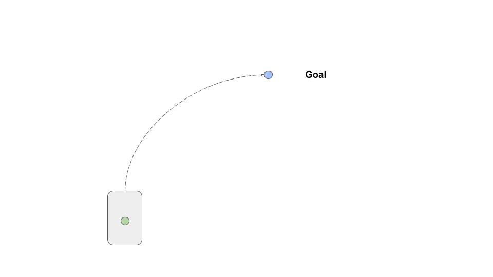

# Odometry

## What problem are we trying to solve?

When we want to travel to a specific position, we can calculate the vehicle’s motion we need to get there. However, if we just pre-plan the trajectory we likely won't reach our goal due to small errors in our model, or other unmodelled factors (e.g. bumps in the road). Instead, we need to be able to track our current position, and adjust our trajectory to reach our goal. 

| |
|:--:|
|*Goal Location*|

In addition, by tracking our position we can place ourselves in a predefined map to help us navigate. For example, Google Maps uses your phone’s gps location to provide odometry for navigation directions. 

## What is Odometry?
Odometry refers to tracking changes in position over time. The odometer in your car tracks the number of kilometres you’ve driven. For self driving, we want to track two components; the position and orientation.

In order to measure changes in position, or orientation we need to define a reference frame. A change in position or orientation only makes sense for an initially starting point. We can take this initial reference to be the car’s starting position and orientation, and calculate all changes relative to that. We also need to define a convention for our axes, and the most-commonly is the right handed frame (x-forward, y-left, z-up).  The following video describes the right handed frame: [Right Handed Coordinate System](https://youtu.be/gJlD2ZCqcKg) 

Position refers to the displacement of the vehicle along any of the three axes (forward/backward, left/right, up/down). 
Orientation refers to the rotation of the vehicle around the three axes (roll, pitch, yaw). 

This frame is often used to describe any object with these six degrees of freedom.
|  |
|:--:|
|*6-Degrees of Freedom Axes*|

Changes in position are referred to as translations, while changes in orientation are referred to as rotations.  

| |
|:--:|
|*Position and Orientation*|

NB: both position and orientation are 3-dimensional, but it is easier to visualize and understand by simplifying to 2-dimensions (birdseye view). Also, cars can only travel in one direction (forward/backwards), and mainly rotate about a single axis (yaw, z-axis), so the simplification is appropriate. 

### Reference Frames
If the car starts in different positions, our reference will be different each time. We become limited to a fixed location. We need a global reference if we want to be able to navigate. A global reference point can be arbitrarily chosen such as a GPS location. We then need some way of transforming our odometry data into this global reference’s coordinate system.
 
### TODO: Viz: global reference frame (show carla global map reference)

In addition, as shown above we need to transform our odometry sensor data (such as an IMU or GPS), into a common reference on the vehicle. As you can see there ends up being a large number of different coordinate systems, some which travel along with the vehicle, and some which are fixed in space. 

### Coordinate Systems and Transformation Matrices
It can quickly become overwhelming to try and keep track of positions and orientations across different coordinate frames. Thankfully, there is a convenient way to keep track of the transformations between coordinate frames, and transform points between them. The following series of videos is a great explanation about Transformation Matrices, which shows how we can transform between frames easily.  

- [Transformation Matricies Part 1](https://youtu.be/I7Xvchh0L_4) 
- [Transformation Matricies Part 2](https://youtu.be/Vt_pSfVcrhI)
- [Transformation Matricies Part 3](https://youtu.be/3zeMsf0vcs4)

In our examples, we will be using the homogeneous transformations. 

How can we calculate odometry?
Now that we have the background of coordinate systems, and reference frames out of the way, how do we actually calculate odometry? There are a number of different methods using a variety of sensors. 

#### Encoders

One of the simplest ways to calculate odometry is to measure the distance the car’s wheels travel. The distance travelled is equal to the number of rotations the wheel makes, multiplied by the circumference of the wheel. To calculate the number of rotations, we can use an encoder. An encoder is a sensor that uses either a magnetic field or optical sensor to measure the rotation of the wheel. 

|   |
|:--:|
|*Wheel Encoder Distance*|

We can then convert these distances into a position and orientation for the vehicle using the following equations. 

|  |
|:--:|
|*Wheel Encoder Odometry*|

Please see page 4 for the derivation of the equations:
[Odometry Tutorial](https://stuff.mit.edu/afs/athena/course/6/6.186/OldFiles/2005/doc/odomtutorial/odomtutorial.pdf) 

- [Wheel Encoder Odometry](https://youtu.be/XbXhA4k7Ur8)
- [How to use Encoders](https://youtu.be/oLBYHbLO8W0)

We now have odometry for our vehicle that is fairly simple, and inexpensive to set up. However, wheel encoders have a number of issues.

If we have wheel slip, due to going over a bump or losing grip, our wheels will spin without actually moving the car. Therefore our car will think it has travelled further than it has, resulting in an odometry calculation. Similar errors can occur if we miss an encoder tick or another type of sensor error.

In addition, each of our sensors and measurements will have an inherent inaccuracy that we can’t get rid of (e.g. our wheels are not always exactly equal to our circumference, due to tyre pressure). If these errors are small and randomly distributed they should cancel each other out over time. 

However, because we don’t have any external reference for our odometry, these small errors accumulate over time. Eventually, they will cause our estimates to be widely off. This type of navigation is called [Dead reckoning](https://en.wikipedia.org/wiki/Dead_reckoning), and is typically not used over long distances due to this error accumulation. It is still useful, as it is easy to calculate, and accurate over a shorter distance, and can be used in situations when other sensors aren’t available (e.g. using gps through a tunnel). 

- [Error Accumulation](https://youtu.be/337Sp3PtVDc)

#### Inertial Measurement Unit (IMU)

Similar to encoders an IMU is a dead reckoning sensor, but can be much more accurate than wheel encoders. 

An imu is a combination sensor, usually consisting of an accelerometer, gyroscope and magnetometer. 
An accelerometer measures the linear acceleration along three axes (x, y, z). 
A gyroscope measures the angular velocity (rate of rotation) about three axes (x, y, z). 
A magnetometer measures the magnitude and direction of the magnetic field along three axes (x, y, z).

We can combine these three measurements to calculate our position and orientation over time. 

The simplest way to calculate orientation is by using the gyroscope data. For this example, we will assume only two dimensions, and we start from an orientation of zero. We can measure our angular velocity about the z-axis, and the time between each measurement. To calculate our current orientation (theta). 

- *theta += angular_velocity_z * d_t*

We can calculate our forward movement by using the accelerometer data. As mentioned earlier we can only travel forwards and backwards in a car, so we will only use the linear acceleration in the x-direction. As a note, remember that the imu is attached to the car, so its reference frame moves with the car, so the x-accelerations in the IMU are always forward/backwards in the car’s coordinate frame.

- *v_x += linear_acceleration_x * d_t*

- *distance = velocity_x * d_t*

We can then multiple our distance by our orientation to get our position:

- *x = distance * cos(theta)*
- *y = distance * sin(theta)*

|   |
|:--:|
|*IMU Odometry*|

And we therefore have our full pose for odometry (position, and orientation). 

- [IMU Odometry Reference Calculation](https://robotics.stackexchange.com/questions/16757/what-is-the-algorithm-to-get-position-linear-displacement-and-linear-velocity)

This calculation is a simplified version of real 3-dimensional IMU calculations, but it is a decent overview of the methodology. Full IMU calculations involved fusing together all three different sensor measurements and including the uncertainties (covariances) of each to weight the estimates. The most common methods use Kalman or [Madgwick filters](
https://nitinjsanket.github.io/tutorials/attitudeest/madgwick).

You might have noticed that these calculations are subject to the same type of error accumulation as wheel encoders. However, IMUs can be made much more accurate than wheel encoders which allow them to minimise the errors that accumulate. Although this accuracy comes with a more expensive price tag, for different applications (e.g. rockets) using a very expensive IMU might be worth it. 

[IMU Price Comparison](https://www.vectornav.com/resources/inertial-navigation-articles/what-is-an-inertial-measurement-unit-imu) 

For self driving, we already have access to a number of different sensors on the car for other purposes. We have cameras for vision, gps for navigation, wheel encoder / tachometer for speed and usually a lidar. Therefore, it probably makes more sense to not spend more money on an expensive IMU just for odometry, and to try to just make use of our existing sensor suite. We will discuss fusing different sensors together later. 

#### Global Positioning System (GPS)

GPS is a navigation system that uses satellites to calculate our position on Earth. GPS works by comparing the timing of messages received from different satellites to determine our position (trilateration). 

[How does GPS Work?](https://www.youtube.com/watch?v=6m0xGwkYYy0)

The GPS information we are interested in for odometry is usually called a fix; latitude, longitude, altitude. We can also calculate speed and heading from these measurements. In order to use GPS data, we need to transform the latitude and longitude into our odometry’s coordinate system. In this case, it makes sense to define a fixed initial odometry coordinate based on a fixed gps location, and transform our data based on that. 

||
|:--:|
|*GPS Frame*|

An example of this transformation can be found here: https://github.com/bsb808/geonav_transform 

Although GPS is a very complicated system, it is quite easy to work with if we only want to get position data. However, there are significant limitations to using GPS for odometry. In general, the data has an accuracy of around 2m, which is suitable for catching an Uber or navigating, but not for positioning a car on the road. This accuracy only decays further if the signal is blocked by buildings or trees, or can be completely lost in a tunnel.   

- [GPS Performance and Accuracy](https://www.gps.gov/systems/gps/performance/accuracy/) 

GPS contains a lot of additional data that can be used to calculate the accuracy and reliability of the information received that we can use to weight our estimates. Similar to IMUs, we can reduce the errors in our GPS receiver through better equipment such as better antennas, clocks or by using a base station. 

- [The Limitations of GPS](https://www.youtube.com/watch?v=U3eX6QKS9kY)

NB: GPS is the USA’s system. The general name is Global Navigation Satellite System (GNSS), and there are a number of [different nation’s with satellite constellations](https://www.gps.gov/systems/gnss/). 

#### Scan Matching

We compare the current scan to the previous. We match the points between scans and find the transformation between them. This transform is our change in position / orientation for the time interval.

|  |
|:--:|
|*Scan Matching Example*|

Matching scans at high frequency can be computationally difficult, but provides very good accuracy (assuming there are enough features to match). However, scan matching requires a lidar that can be an expensive component. Lidar scan matching is the most widely used method for localizing to a predefined map. Maps can provide a lot of additional information without having to calculate it in real-time, such as lane lines or traffic light locations. We will discuss mapping in another post. 

[Scan Matching Tutorial](https://www.youtube.com/watch?v=LETPf6eoyYg)

#### Visual Odometry

Similar to lidar based scan matching, visual odometry matches features in an image stream.  A feature can be any distinct marker we can find in consecutive images, such as edges, or corners. Due to the high frame rates required for good results, it is common to use [ORB features](https://en.wikipedia.org/wiki/Oriented_FAST_and_rotated_BRIEF) for speed. 

| |
|:--:|
|*ORB Features*|

Can be very complicated to track image features between frames, and calculate the transform between them. To do so, we need to calculate the [Fundamental Matrix](https://en.wikipedia.org/wiki/Fundamental_matrix_(computer_vision)) to relate points in one image to the other.  It can be very sensitive to calibration and estimation errors, as well as being computationally expensive to compute. The calibration and computation problems are one of the core challenges for visual odometry systems. 

|   |
|:--:|
|*Feature Matching*|

As cameras are cheaper than lidar, visual odometry offers a more scalable approach to odometry that can be used across different robotic platforms. Visual odometry is a very complicated topic, and requires a lot of background knowledge to start with. One of the most common starting points is to use the KiTTi dataset to test out different approaches. As KiTTi itself can be confusing to start, this video series provides a great introduction to the problem and the dataset: [Visual Odometry and KiTTI Tutorial](https://www.youtube.com/watch?v=SXW0CplaTTQ) 

### Fusion
As discussed, every odometry method has challenges and limitations. We can combine different estimates using sensor fusion methods. These can provide a more accurate estimate overall, and allows different sensors to cover the weaknesses of the others. For example, when travelling through a tunnel where gps is not available, we would rely more on other sensors.  

The most common fusion involves using a Kalman Filter, which combines weighted estimates of the different predictions and measurements.. 
A good resource for learning about Kalman Filters is the online book available here: [Kalman Filter Online Book](https://nbviewer.jupyter.org/github/rlabbe/Kalman-and-Bayesian-Filters-in-Python/blob/master/table_of_contents.ipynb) 

| |
|:--:|
|*Optical Flow Example*|

## Conclusion
Odometry is an important component of any autonomous system. The vehicle’s position and orientation is used in the perception, localisation, planning and control systems. 

Odometry calculations are particularly sensitive to sensor quality due to the accumulation of errors. As this improved quality is more expensive, we need to evaluate the tradeoffs when designing a system. We can opt for more expensive odometry sensors, or try to achieve the same performance with a clever combination of sensors we require for other tasks. Whether or not the system relies heavily on a mapping approach will play a significant factor in these design decisions.   

## Additional References

**Reference Frames**
 
- [The Camera Transform](https://youtu.be/mpTl003EXCY) 
- [OpenPilot Transformations](https://github.com/commaai/openpilot/tree/master/common/transformations)

**Wheel Encoders**
- [Location using Wheel Encoder Data](https://robotics.stackexchange.com/questions/9171/plotting-location-using-wheel-encoder-data)
- [Arduino Wheel Encoder Odometry](http://andrewjkramer.net/arduino-odometry/) 
- [Arduino Wheel Encoder Repository](https://github.com/EwingKang/Simple-ROS-Arduino-odometry#encoder)

**IMU Odometry**
- [ROS Robot Localisation Package](http://docs.ros.org/en/melodic/api/robot_localization/html/index.html)

**GNSS**
- [OpenPilot GNSS Processing Library](https://github.com/commaai/laika)

**Visual Odometry**
- [Monocular Visual Odometry Repository](https://github.com/avisingh599/mono-vo)
- [Monocular Visual Odometry Demo](https://www.youtube.com/watch?v=homos4vd_Zs)
- [Estimating the Fundamental Matrix](https://cmsc426.github.io/sfm/#estfundmatrix)
- [TwitchSLAM](https://github.com/geohot/twitchslam)
- [Visual Odometry For Autonomous Vehciles](https://www.journalijar.com/article/29806/visual-odometry-for-autonomous-vehicles/) 
