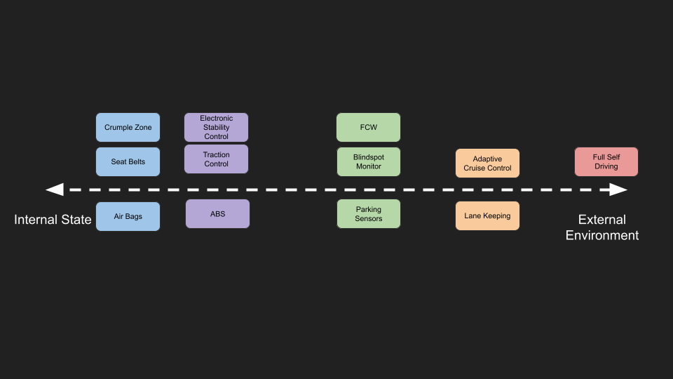

# Safety Systems

Modern cars are incredibly safe, and are masterpieces in terms of safety technology. In the event or lead up to a crash, many systems automatically deploy to reduce the probability of an accident, reduce the severity of the crash, and keep the occupants safe. Cars are now so safe that road deaths have actually been going down over time, and have [decreased 20% since 2010](https://www.roadsafety.gov.au/performance/road-deaths-road-user). Despite this, over 1000 people still died on the road last year in Australia. One of the great promises of self driving technology is to improve vehicle safety. In order to design these systems for safety, we first need to understand modern safety systems, and road safety, (road safety isn't just about car design, but also about road design. For now we are just going to focus on the car side for now).

## Modern Safety Systems
Before we look into self driving systems, we need to explore some of the safety systems in a modern car. There are a number of different categories you could split these up into, but I have just chosen three; survival, alerts and control. 

### Survival Systems
The first category are the survival systems. These include the restraints and mechanisms that keep you alive in the event of a crash, such as seat belts, airbags and crumple zones. These systems are very passive and reactive, they don’t prevent or reduce the impact of a crash, all they do is protect the occupants after a crash has happened. They reduce the likelihood of injury or death in a crash. They are mostly mechanical systems, with simple, redundant sensing mechanisms. 

### Driver Alerts
The second category are the alerts, such as forward collision warning (FCW), lane departure warnings, blindspot warnings and parking sensors. They are used to communicate to the driver that the car thinks something is about to go wrong, and they should pay attention, or adjust their driving. An example is the FCW, which is a camera or radar that looks ahead and determines if something is in the path of the car or you are about to hit something, it will send off a beep or an alert to the driver to do something about it. These systems aim to provide additional sensing capabilities to the driver that they wouldn’t usually have (e.g. blind-spot monitoring). These systems are fairly passive, requiring the driver to take action, and are usually a combination of sensors, and software logic to determine when to send an alert. 

### Vehicle Control
The third category is the group of systems that actually take control of the vehicle. These systems include anti-lock braking (ABS), traction control, and electronic stability control. These systems measure different systems in the car (usually wheel speed), and detect if something is going wrong, and apply a corrective control action. For example, anti-lock brakes measure the wheel speeds, and rapidly switch the brakes on and off if they detect you have locked up the brakes. This enables you to maintain control of the steering, and reduce the braking distance in an emergency braking scenario. Without ABS, it would take longer to stop, and you would lose control of the car, as sliding wheels have less grip and steering ability and are unstable (Please see this [video for a good explanation](https://youtu.be/98DXe3uKwfc). Similarly, [Traction Control](https://youtu.be/ZcrA51GPMCQ) and [Electronic Stability Control](https://youtu.be/MCRLKRluk1w) help control the vehicle during acceleration and cornering. Most people would not know about these systems on their cars, and might not realise that the computers in your car are already frequently taking control of the vehicle. These are very active systems, and utilise sensing, and complex software to control the car. 
 
If we draw these systems on a number of axes we can see the trend from passive, mechanical systems to active software systems. 

Additionally, we can also see that safety systems are now concerned with not only what is going on inside the vehicle, but also considering the external environment and other vehicles on the road. 

## Crash Statistics
Despite all these systems, there are still many crashes on the road each year. In order to successfully design self-driving safety systems, we first need to understand more about what crashes happen on the road, and why they happen. To do this, we are going to examine the Victorian crash data available from [VicRoads](https://discover.data.vic.gov.au/dataset/crash-stats-data-extract). We’re going to attempt to answer a few questions, in order to help us develop these safety improvements. 

The three questions are:
1. What are the most common types of crashes?
2. What are the most serious types of crashes?
3. Why do these crashes occur?

To understand this data a little better, each crash is categorised in a number of different ways. Some of the fields in the crash data are shown below.

This data includes, the type of crash (what happened in the crash), type of vehicle, , road geometry, number of vehicles involved, location, and the severity level (and much more). There are four severity levels:
1. Fatal Accident: Somebody has died
2. Serious Injury: Somebody has gone to hospital
3. Other Injury: injury occurred but hasn't gone to hospital
4. Non-Injury: No injuries occurred. 

If we plot the number of each type of crash, we can see that the rear-end is the most common type of crash. This is where one car crashes into the back of another car. 

We can further break down this data by severity.  As we can see most of the crashes result in an injury, not a trip to hospital. 

### Common Accident Types
Combining these two factors, we can break down the crash types by severity. The rear end is the most common for both serious and other injury severity levels. 

If we wanted to minimise the amount of crashes that happen this is the type of crash we would target. How would we go about preventing rear end accidents? T We can imagine most of the time, these rear ends occur because the driver behind isn't paying attention, or does not anticipate the vehicle ahead braking, or stopping suddenly. We would want a system to monitor the vehicle in front, and adjust our speed based on how far away they are and how fast we are travelling. Using this we could prevent or minimise the impact of these types of rear end collisions.  

This is the goal of systems like Adaptive Cruise Control, and forward collision warning / emergency braking. These systems detect the vehicle ahead and adjust your speed to keep you a fixed distance away from the lead car (ACC), or slam on the brakes if they think a collision is imminent (AEB).  

### Fatal Accidents
If we filter for fatal accidents, the picture changes. Rear ends are comparatively less dangerous than other types of crashes. From the data we can see that the head on is the most serious type of crash, followed by vehicles leaving the road and crashing into parked cars or stationary objects. 

This makes intuitive sense, as in a head on, the cars have the most energy when they hit each other, and crash right at the driver (rather than glancing off). Similarly, if the vehicle goes off the road, the driver tends to lose all control, and is likely to hit something (like a tree) very bluntly. Both of these types of crashes are the result of a driver leaving their lane and going into either oncoming traffic or off the road entirely. If you have ever driven on a country highway where the speed limit is 100, with only one lane each way and no divider, you can imagine how these types of accidents occur. 

Digging a bit more into the severity data, we can see that the majority of accidents occur in the 50-60 km/h speed zones, but these accidents are mostly  of a lower severity level. As the speed increases, we can see an increase in the severity of the accident. The 100 k/h (freeway zone) has the most fatal accidents, indicating a correlation between speed and the severity of the crash. 

Therefore, if we are interested in preventing fatal accidents, our systems need to prevent the car from unintentionally leaving the lane, and operate at freeway speeds. We can’t just focus on low speed environments, we need to be able to control the car at high speed on the freeway to prevent deaths. 

Lane Keeping Assist systems are designed to keep the vehicle centred in the lane, and to operate at freeway speeds. These systems automatically adjust the steering of the car to keep it positioned in the lane. In addition, lane departure warnings can inform the driver if they begin to drift across lane lines. 

### Crash Causes
So why do people crash cars? People obviously don’t want to get into an accident, so why does this happen? If we look at the top reasons why crashes occur, the top reasons are; Speed, Alcohol, Fatigue and Distraction. 

||
|:---:|
|Common Causes of Crashes ([Source](https://www.budgetdirect.com.au/car-insurance/research/car-accident-statistics.html))|

Again we see speed coming up as a main culprit. As a human, the faster you go the less time you have to react and the more serious any little mistake is. Alcohol, if you’ve been drinking your abilities are impaired, your reactions are slower, you can’t see things as well. Distraction, the most common type of distraction is probably people looking at their phone. If they are looking at their phones, they aren’t paying attention to the road, and it's easy for things to go wrong. Fatigue, if you are tired your reactions are slower and you’re not paying attention, you’re more likely to make mistakes. 

Many cars with driver assistance features (lane keeping, adaptive cruise control, etc) utilise a driver monitoring system to make sure the driver is paying attention to the road when these features are engaged. They monitor if the driver has their hands on the wheel, where their eyes are looking, and if they are distracted or asleep. These types of systems could reduce the number of accidents due to distraction or fatigue. Many self-driving systems can automatically detect speed signs (or read the data from a map), to determine the speed limit. Through this we could also implement alerts if the driver begins to travel above the speed limit. 

## Self Driving Systems
Most of these self-driving technologies discussed are now becoming available on modern road cars. We can now add these self-driving systems to the safety system axes we drew earlier to see how they compare with the other safety systems discussed. 

We could have drawn a number of other axes, such as the number of systems involved, and the level of vehicle control, and we would have seen the same trend. Over time, safety systems are becoming more complex, and incorporate much higher levels of control over the vehicle. They are responsible for a wider variety of tasks, and much less clearly defined tasks. As such, software is becoming a more significant focus for safety systems, as well as more sophisticated sensing systems (compare detecting high deceleration to understanding the environment around the car). 

From this perspective more advanced self driving features are just more advanced safety features. Over time safety systems have become more active, and preventative in their role, and importantly they have become more software based. Advanced self driving can be viewed as natural extensions of these safety systems in the car. In the future, ‘Full Self Driving’ systems will take on an even more active, more predictive role, and be able to fully control all systems in the vehicle.   

A common complaint about self driving systems is that people want to be in control of their car in an emergency. The reality is that a modern car already doesn’t trust you in an emergency and takes control of the situation, and as a result everyone is safer. 

## Conclusion
In this post we discussed modern vehicle safety systems, and compared them to self driving systems that are currently available and coming soon. There is significant overlap in the design of safety systems, and self-driving systems, including more integrated software, sensor suites and level of vehicle control. Given one of the primary goals of self-driving technology is to improve vehicle safety, it makes sense to understand the developments that have led to current safety technology, and where it is going in the future. 

*Thought exercise:*

Is an automatic transmission a self driving system? Why / Why not?
- https://en.wikipedia.org/wiki/Automatic_transmission 

## Reference
- https://en.wikipedia.org/wiki/Advanced_driver-assistance_systems 
- https://en.wikipedia.org/wiki/Automotive_safety 
- https://www.racq.com.au/cars-and-driving/safety-on-the-road/car-safety-features 
- https://www.ancap.com.au/understanding-safety-features 
