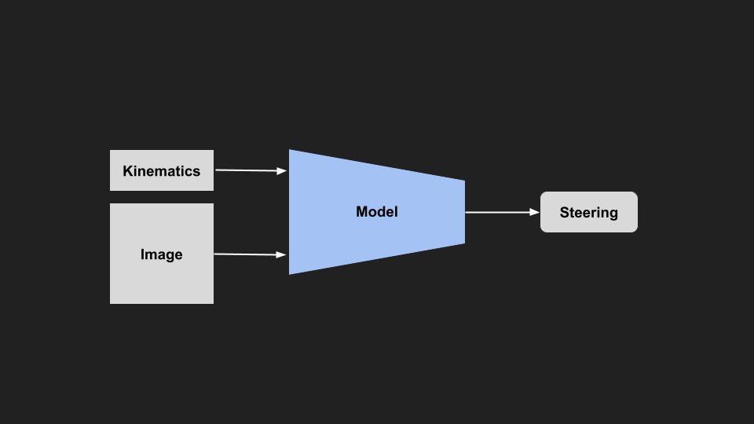
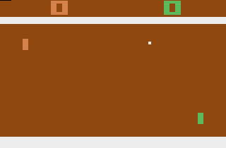
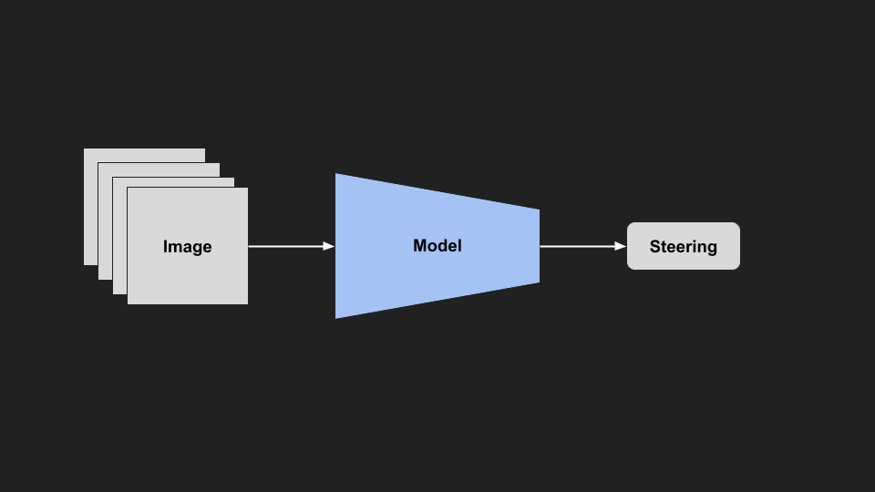
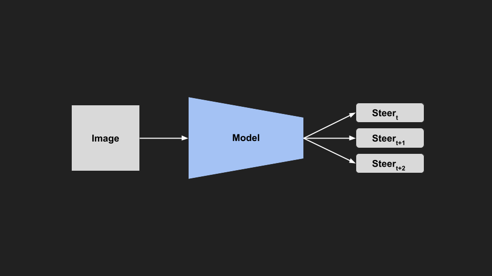
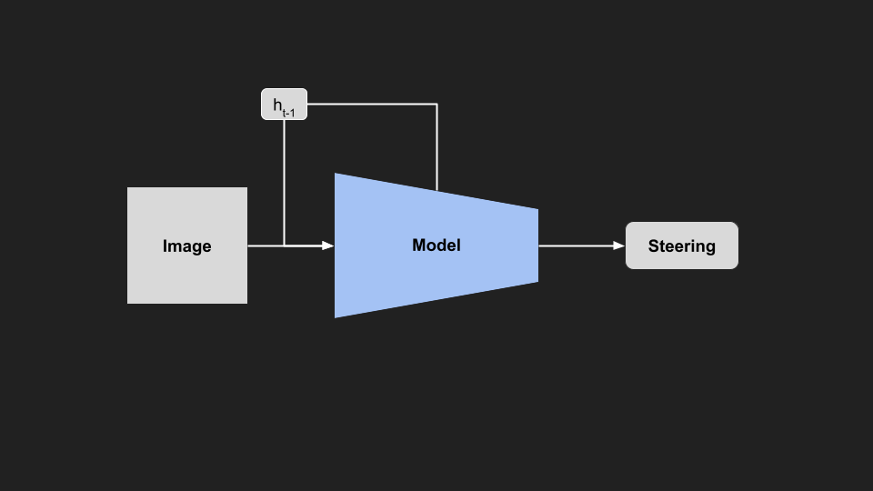
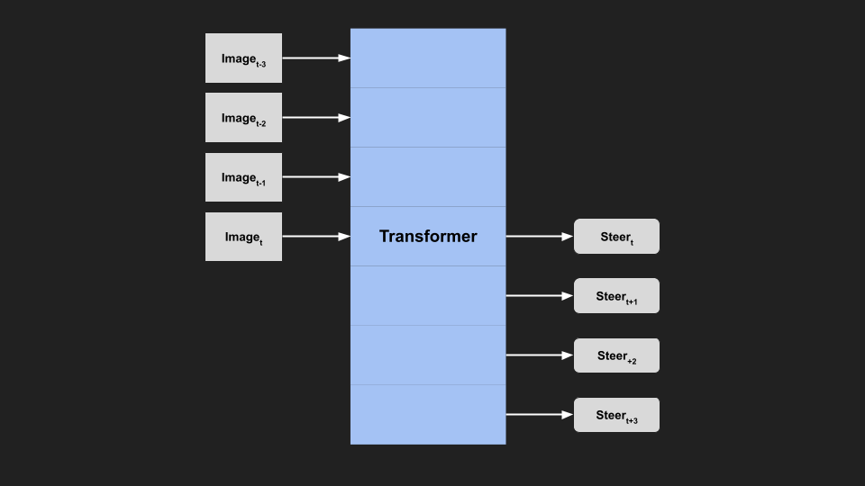
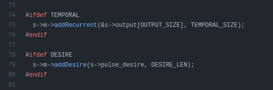
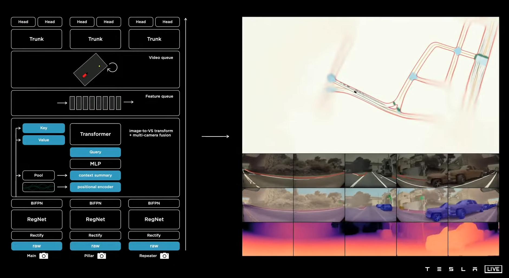
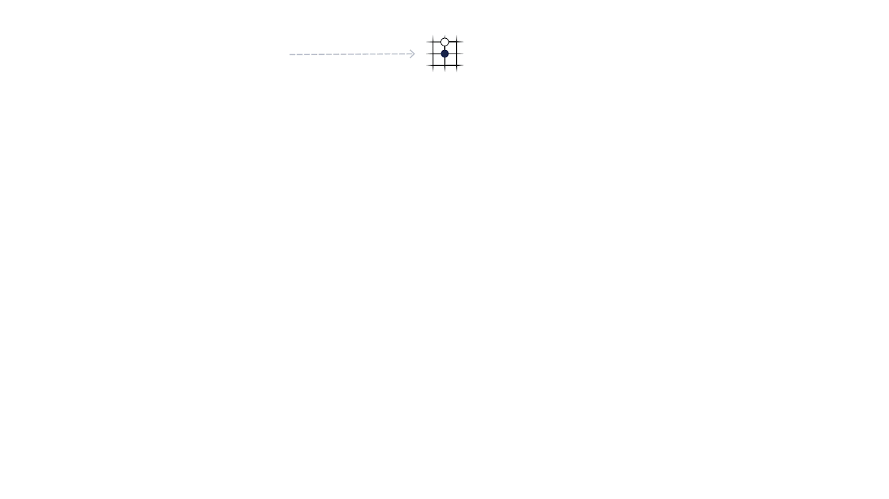

# Temporal Models

In our classic imitation learning setup, we trained a model to output steering commands based on an input image. Our goal was to get a model to copy the way I was driving the car. But if we think about it, when we drive we have access to much more information than the model, so it was no wonder that the model was limited. 

When we drive, we take into account what's happened in the past, and also predict a little bit into the future. We think about how fast we are going, how much momentum we have, how quickly can we stop, what are the other people going to do, does this road continue around the corner. We want to be able to pass this kind of past, and future information to our model, so it can have access to the same amount of information.

||
|:---:|
|Image Motion|

The importance of temporal information in end to end learning has been [discussed before](https://arxiv.org/pdf/1708.03798.pdf). From a single image, there is no way of telling how fast we are going, whether we are rotating or what others are doing. We need to figure out how to feed this temporal information (information about time, through time) to the model. 

## Ideas
Here are a few ideas for how we might go about this:

**Kinematics Input**

First way is to straight up feed the information we care about, such as velocity, accelerations, rotations, or anything else into the model as an additional input. This would allow the model to use the info if it is useful, but ignore it when it isn't. For example, velocity might be important as you would need to turn the wheel a different amount if you were travelling faster or slower. This kind of info is very easy to get from the car, or a cheap sensor. It's fairly explicit, we know exactly what we are feeding to the model, and there is no extra encoding the model has to do (unlike additional images). So it might be a quick and useful starting point. 

||
|:---:|
|Kinematics Input Model|

**Frame Stacking**

Another thing we could do, is an older trick from reinforcement learning for playing games. If you train a model to play a game like pong, and you only feed it a single image, there is no way for the model to tell which way the ball is going. To get around this, they feed a stack of consecutive images. This is originally from the [DQN](https://arxiv.org/abs/1312.5602) paper for playing Atari games. 

||
|:---:|
|Frame Stacked Pong|

They feed in the previous four images, and from this you can tell the direction the ball is going. We could easily feed in several frames, and the model can infer the direction, and speed of things from the frames. 

||
|:---:|
|Frame Stacked Model|

**Sequence Output**

Conversely from the previous idea, instead of feeding in a sequence of images, we could train the model to output a sequence of steering commands. This would direct the model to make a much more consistent sequence of predictions, rather than each prediction being completely independent. We could then also add some control limitation to enforce this smoothness and consistency, so the model can’t change too much between frames. This would make the model much more consistent between frames.

||
|:---:|
| Sequence Model|

**Sequence Modelling**

If we put those last two ideas together, we have a sequence as input, and sequence as output, ending up with a sequence-to-sequence problem. 
- [Seq2Seq Explained](https://paperswithcode.com/method/seq2seq)
- [Seq2Seq with Attention Example](https://jalammar.github.io/visualizing-neural-machine-translation-mechanics-of-seq2seq-models-with-attention/ )

These types of problems are common in natural language processing, as many tasks involve converting a sequence (e.g. text or audio) into another sequence. For example, in language translation, we might want to convert an English input sentence to an output sequence in French.  Looking to those domains for inspiration, we could use a recurrent neural network style model, where we explicitly treat the problem as a sequence. In an RNN, the hidden state of the model is passed forward to the next timestep, and used as context for the next prediction. In our example, we pass the hidden state between frames, allowing the model to learn through time. 

||
|:---:|
|Recurrent Model|

**Transformers**

If we are taking inspiration from language models, we should look into Transformer style models and attention. Similarly to RNNs, Transformers work on sequences. However, unlike an RNN passing a hidden state through each timestep, the attention modules in Transformer allow it to learn which part of the input sequence to pay attention to. Unlike the RNN hidden state (which is diluted over time), attention allows the model to choose where in the sequence to consider for each prediction. 

||
|:---:|
|Transformer Model|

A potential issue with Transformers is that they perform better with larger model size, and data (e.g. [GTP-3](https://arxiv.org/abs/2005.14165)), which might become an issue trying to run in real time in a car.

- [The Illustrated Transformer](https://jalammar.github.io/illustrated-transformer/)

## Examples
All these ideas aren’t new, they have been used in different domains or self driving applications:

**OpenPilot**

The openpilot model uses a recurrent block for temporal information, and it also outputs a sequence (a planned path) for the car to follow. 

||
|:--:|
|OpenPilot Temporal Module [[1]](https://github.com/commaai/openpilot/blob/master/selfdrive/modeld/models/driving.cc),[[2]](https://medium.com/@chengyao.shen/decoding-comma-ai-openpilot-the-driving-model-a1ad3b4a3612)|

### Wayve
In Wayve’s future prediction model (FIERY) they use stacked sequence of input images, and output a sequence of predictions about vehicle segmentation and motion. 

| 
|:--:|
|Wayve Temporal Model [[Source](https://wayve.ai/blog/fiery-future-instance-prediction-birds-eye-view/)]|

### Tesla
Tesla seems to be throwing the kitchen sink at the problem. Presented at their AI day, their latest version passes kinematics to the model, utilises a transformer, a video module and spatial RNN to perform end to end perception.  

|
|:--:|
|Tesla Perception Model [[Source](https://youtu.be/j0z4FweCy4M?t=4342 )]|

### Reinforcement Leanring
In reinforcement learning, many different methods have been developed for considering how actions impact the future. Examining some of these methods, such as Monte Carlo Tree Search (MCTS) or reward discounting could help improve our future predictions.

||
|:--:|
|MuZero MCTS [[Source](https://deepmind.com/blog/article/muzero-mastering-go-chess-shogi-and-atari-without-rules)]|
    
## Discussion
One thing we need to consider is how much temporal information we need to drive properly. When we drive we are primarily concerned with a small window around the present (maybe 5 seconds). We don't necessarily need to know what happened 30 seconds ago, as most of the important information is mostly in the present. Compared to language, you need to know words in the previous sentence to understand the current sentence, or game playing where we need to plan very far into the future. Driving mostly happens over short time horizons. 

However, this longer term information might be useful in some situations, such an when another vehicle is occluded (see Tesla AI Day presentation for good discussion). The more temporal information we feed into the model, the longer our inference times will be. We need to explore how much we should trade off thinking about the past and future, compared to running our model faster.  

## Conclusion
In the classic imitation learning setup, we ignored the fact that our problem is a sequential decision making one. Our current state and actions impact our future. In order to continue training our model in this way, we needed to find a way to pass our model information from the past, and get it to consider what will happen in the future. In this post, we explored different methods for incorporating temporal information into our model, and how these methods are used in the real world.   
