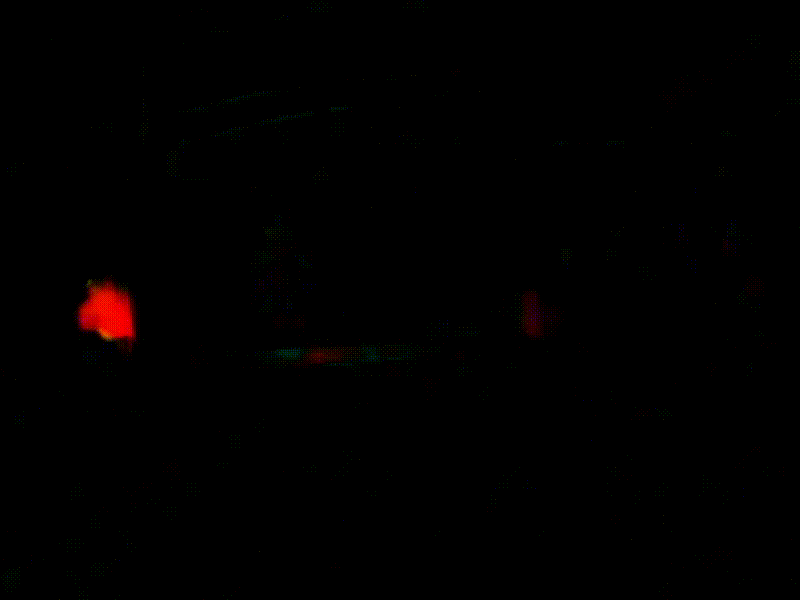

# Object Tracking

Self driving cars need to understand the world around them, in order to navigate. An important part of this is detecting other objects, such as pedestrians and vehicles, and predicting what they are going to do next. In order to predict what they will do next, we first need to be able to track them over time to understand their movement and behaviour. 

## Problem

Tracking can be used to solve a number of different problems:

Detections can fail to detect objects for a number of reasons (e.g. model failure, object occlusion). By tracking objects over time we can cover for failures in any given frame by using the previous known position of the object. 

Through tracking, we can identify the same object through time which allows us to follow an individual agent.  We can then identify properties about it, for example, we might track an individual player on the field to identify their path and actions, or allow a camera drone to follow a person. This problem is sometimes called Re-identification.

Most importantly for self-driving, tracking objects forms a basis for making predictions about what they might do next. From tracking we can determine the velocity of an object, as well as their past behaviour so we can make an informed prediction about where they are going, and what they are trying to do. This is important because we don't just want to react to objects in the world as that becomes a test of reaction times, and actuation response. Instead we want to predict what will happen next, so we can plan accordingly.For example, we want to predict if a pedestrian is going to cross the road, or if a car is going to merge into our lane. 

For this post, we are going to use a couple of small example scenes of pedestrians crossing the road. The scene was collected using the [CARLA simulator](https://carla.org/). 

To motivate the need for tracking, lets see the output of the object detector.

In the first clip, as the pedestrian goes behind the pole, the detector loses them. 

In the second clip, as the pedestrians get close together the detections become confused by the overlapping, and we again lose a detection. 

### Definition
There are multiple types of tracking problems, each requiring a different solution. 

Single vs Multi Object
For single object tracking we are only interested in tracking a single instance of the object through time. This can be a simple case of tracking a single face in a video stream, or a more complicated case of tracking an individual person through a crowd. Multi-object tracking refers to tracking all instances of the object, such as tracking all the people walking through a shopping centre. 

Single vs Multi Class
Single class tracking assumes that all objects tracked belong to the same class, and doesn’t distinguish between different types of objects. For example, we might only be interested in tracking pedestrians, and filter out any other types of objects we detect. Multi class tracking requires multiple types of objects to be tracked simultaneously. We have to retain a class label for each object we are tracking (such as pedestrian or vehicle). 

Online vs Offline
Online tracking runs in real time, and objects must be detected, and tracked before the next camera frame can be processed. In this kind of tracking, we only have access to the current frame and any past information about the objects we retain. This is the type of tracking most autonomous systems use in order to move about the world. Offline tracking doesn’t need to be processed in real time, and can use information from the future to improve the tracking algorithm. For example, if the detector loses an object, but picks it back up later, we can use this future information to correct the missing detections and improve our tracking. In addition, these kinds of algorithms can be much more computationally expensive than online tracking. Offline tracking methods are suited to running analysis on a video stream.

Specifically for self-driving, we are interested in multi-object, multi-class, online tracking. 

In this post, we are going to be talking about tracking by detection. Using this method, we use a detector to detect objects, and then run a tracker on the detection output.  There are other methods for tracking (e.g. [optical flow](https://en.wikipedia.org/wiki/Optical_flow)) for different applications.

## Methods

Our goal in tracking is to identify the same object in each frame over time. We can come up with some intuitive ways to think about how we might find the same object in different frames.  
If there isn't a lot of time between frames, our object will be in relatively the same position between them. Therefore, if detections in consecutive frames are close to another, then they are likely to belong to the same object. We will call this the **Distance** metric.  

The appearance of our object shouldnt change significantly over time. Therefore, we can compare how our detections look in one frame to another. We will call this the **Appearance** metric. 

Once we have detected an object in a few frames, we can make a rough prediction about how it is moving. Once we have this motion model, we can predict where it is likely to be located in the next frame. We will call this the **Motion** metric. 

### Calculating Metrics

#### **Distance**

There are a number of different ways to calculate whether two objects are “close” to one another. Some of the most common include:

*Euclidean distance*

The euclidean distance (straight line distance), between the centre of each detection provides a simple way for measuring distance. The distance is measured from the centre point of each bounding box. Euclidean distance is a useful metric as it is fast to calculate, and scales easily to 3-dimensional objects.

*Intersection over Union (IoU)*

The IoU method evaluates how much the bounding boxes overlap compared to their overall size. The greater proportion of the bouncing box that overlaps, the higher the IoU score. For bounding boxes that don’t overlap, the IoU is zero, regardless of how close or far away they are. 

#### **Appearance**

*Bounding Box Size*

The simplest way to compare object appearances is to evaluate the size of the bounding box. As long as the object is not moving very fast, or the perspective isn’t changing significantly, the size of the bounding boxes should be fairly consistent over short time periods, and only change slowly.

*Image Similarity*

For two different detections we can calculate how ‘similar’ the images inside the bounding boxes are. The assumption is that the same object will appear similar in subsequent frames, when compared to other detected objects. There are a number of methods for calculated similarity, ranging from colour, feature or template matching, to more sophisticated CNN methods.  An example of image similarity in action is  Google’s reverse image search. The downside of these methods is that they can be computationally expensive (take a long time), which can have large downsides for real time tracking.

#### **Motion**
*Constant velocity model*

Once an object is successfully tracked, we can calculate it’s motion and use it to predict where it will be detected next. This simplest method is to assume the object travels at a constant velocity, and use that to predict where the next detection will occur. 

*Kalman Filter*

We can improve our predictions by using a kalman filter to better estimate of the tracked object. A Kalman Filter is a probabilistic algorithm that combines predictions and measurements to produce a more accurate measure of whatever we are trying to measure. Kalman Filters are very common and useful tools for state estimation problems. A great resource for learning more about them is the Kalman Filter Online Book.

Once all these metrics are calculated, they are combined into a score representing how well a detection matches a tracked object. The lower the score the better the match. 

### Assignment Problem
We need to assign each of our new detections to an existing tracked object, or create a new object if there is no matching track. However, we don’t just want to match the lowest score to each tracked object, as this will likely lead to unmatched tracks especially when objects are close or overlapping. We need to minimise the overall score for all the tracks and detections, to ensure that we are getting the best matches across all objects. This is called the assignment problem. 

#### **Cost Matrix**
Once we have calculated all these metrics, we need to combine them into a cost matrix that describes how well each new detection matches with the existing tracked objects. The cost matrix contains a score for each detection and track pair, as well as dummy rows and columns for unmatched detections/tracks. These dummy columns contain a minimum score that helps filter out false positives and prevent mismatched tracks.

Example Cost Matrix

| Tracks / Detections | Det 1 | Det 2 | Det 3 | No Match |
|:-------------------:|:-----:|:-----:|:-----:|:--------:|
|       Track 1       |  100  |  200  |  300  |    200   |
|       Track 2       |  250  |  150  |  250  |    200   |
|       No Match      |  200  |  200  |  200  |    200   |
|       No Match      |  200  |  200  |  200  |    200   |

#### **Association**
Once the cost matrix is constructed, we need to find the best way to match detections and tracks to minimise the overall score. The most common method is to use an [optimisation method](https://en.wikipedia.org/wiki/Hungarian_algorithm#the_problem), to solve the problem. Once the association is complete, each detection is matched to a track, creates a new track, or is discarded, and our tracking algorithm is ready to process the next frame. 

## Reference
**Detection**
- [Intersection over Union (IoU) for object detection](https://www.pyimagesearch.com/2016/11/07/intersection-over-union-iou-for-object-detection/)
- [Object Detection for Dummies Part 3: R-CNN Family](https://lilianweng.github.io/lil-log/2017/12/31/object-recognition-for-dummies-part-3.html)
- [Object Detection Part 4: Fast Detection Models](https://lilianweng.github.io/lil-log/2018/12/27/object-detection-part-4.html)

**Tracking**
- [Simple object tracking with OpenCV](https://www.pyimagesearch.com/2018/07/23/simple-object-tracking-with-opencv/)
- [Multiple Object Tracking in Realtime](https://opencv.org/multiple-object-tracking-in-realtime/)
- [Simple Online and Realtime Tracking](https://arxiv.org/abs/1602.00763)
- [Kalman and Bayesian Filters in Python](https://nbviewer.jupyter.org/github/rlabbe/Kalman-and-Bayesian-Filters-in-Python/blob/master/table_of_contents.ipynb)
- [CV3DST - Object tracking](https://www.youtube.com/watch?v=QtAYgtBnhws)
- [SciPy: Linear Sum Assignment](https://docs.scipy.org/doc/scipy-1.7.0/reference/generated/scipy.optimize.linear_sum_assignment.html)
- [Introduction to Motion Estimation with Optical Flow](https://nanonets.com/blog/optical-flow/)
- [Understanding Sensor Fusion and Tracking, Part 5: How to Track Multiple Objects at Once](https://youtu.be/IIt1LHIHYc4)
- [Assign detections to tracks for multiobject tracking - MATLAB assignDetectionsToTracks](https://www.mathworks.com/help/vision/ref/assigndetectionstotracks.html) 

**Repositories**
- [yehengchen/Object-Detection-and-Tracking: Object Detection and Multi-Object Tracking](https://github.com/yehengchen/Object-Detection-and-Tracking)
- [abewley/sort: Simple, online, and realtime tracking of multiple objects in a video sequence.](https://github.com/abewley/sort)
- [wmuron/motpy: Library for tracking-by-detection multi object tracking implemented in python](https://github.com/wmuron/motpy)